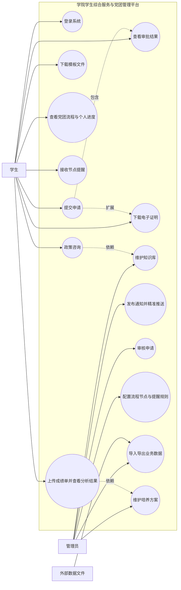
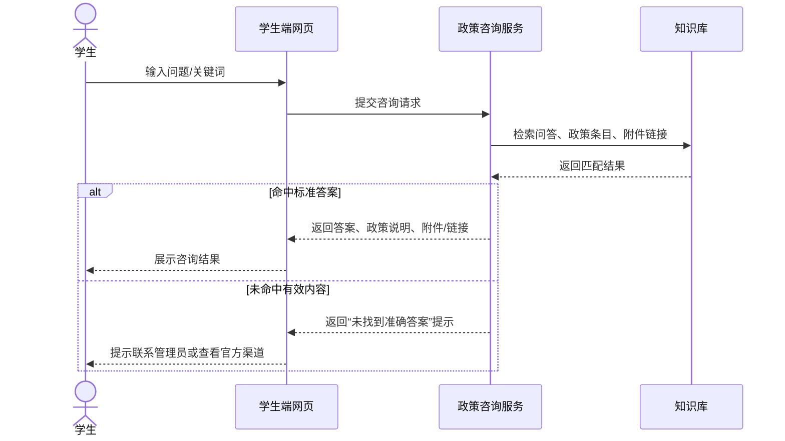
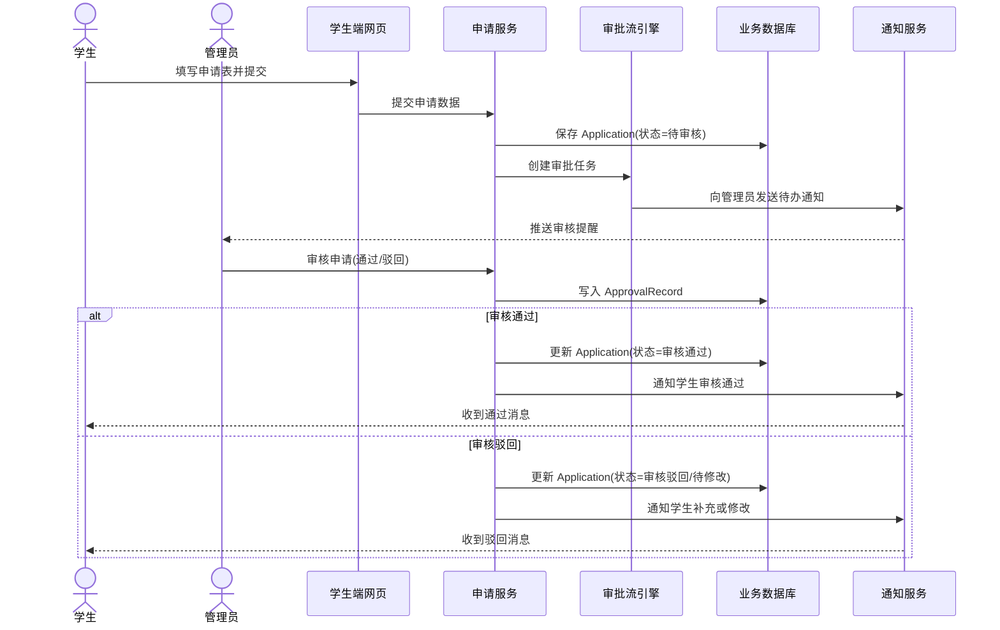
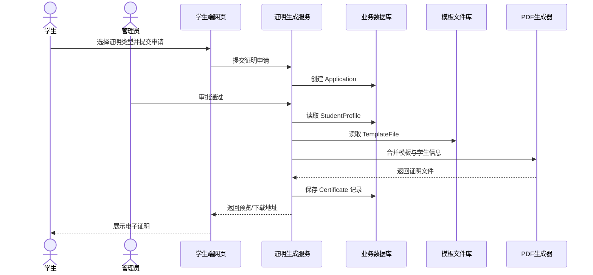
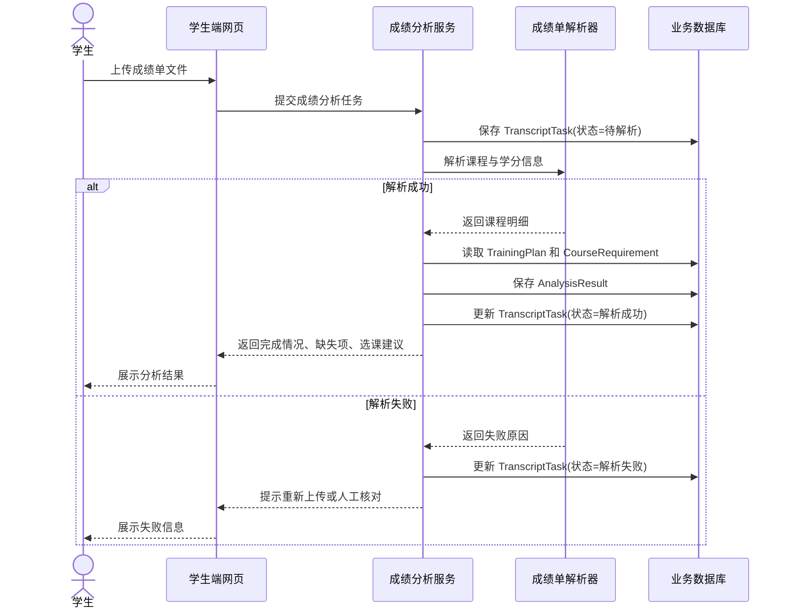
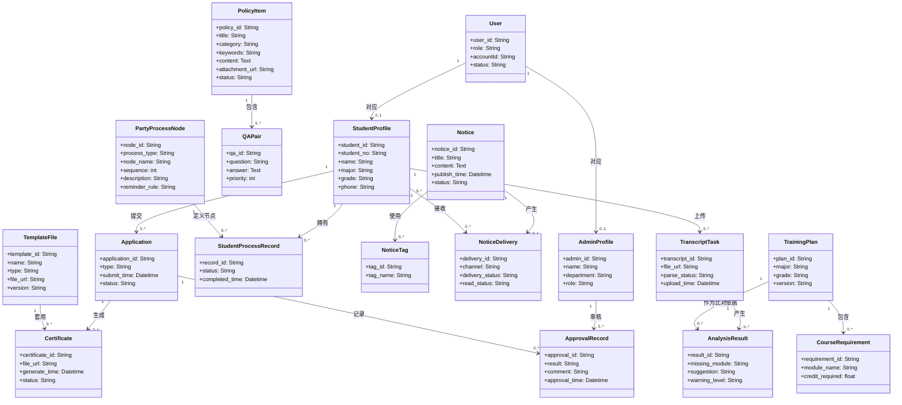

# 学院学生综合服务与党团管理平台 UML 图

本文档基于仓库中的需求文档和模板文档整理，使用 Mermaid 绘制 UML 用例图、分析模型顺序图和分析类图，便于直接插入课程文档或继续导出为图片。

## 1. UML 用例图

用例图说明：

- 学生侧重点是查询、申请、进度查看、证明获取和成绩分析。
- 管理员侧重点是知识库维护、通知发布、审批流处理、流程配置和数据维护。
- 外部数据文件主要参与模板导入、批量导入导出和培养方案维护等场景。

## 2. 分析模型顺序图

### 2.1 政策咨询顺序图

### 2.2 申请审批顺序图

### 2.3 电子证明生成顺序图

### 2.4 成绩分析顺序图

## 3. 分析类图

类图说明：

- `User` 是统一账号抽象，向下对应学生资料或管理员资料。
- `Application + ApprovalRecord + Certificate` 构成申请办理与电子证明的核心业务链。
- `PolicyItem + QAPair` 支撑政策咨询与知识库问答。
- `PartyProcessNode + StudentProcessRecord` 支撑党团流程可视化与节点提醒。
- `TrainingPlan + CourseRequirement + TranscriptTask + AnalysisResult` 支撑成绩分析与学业预警。

## 4. 使用建议

- 如果你们要直接交课程文档，可以把本文件中的图复制到 `template.md` 的 `3.2` 和 `3.3` 小节。
- 如果老师要求导出图片，可以用支持 Mermaid 的 Markdown 编辑器直接导出 PNG 或 SVG。
- 如果你还需要 `状态图`，下一步最适合补的是“申请单状态图”和“党团流程节点状态图”。
