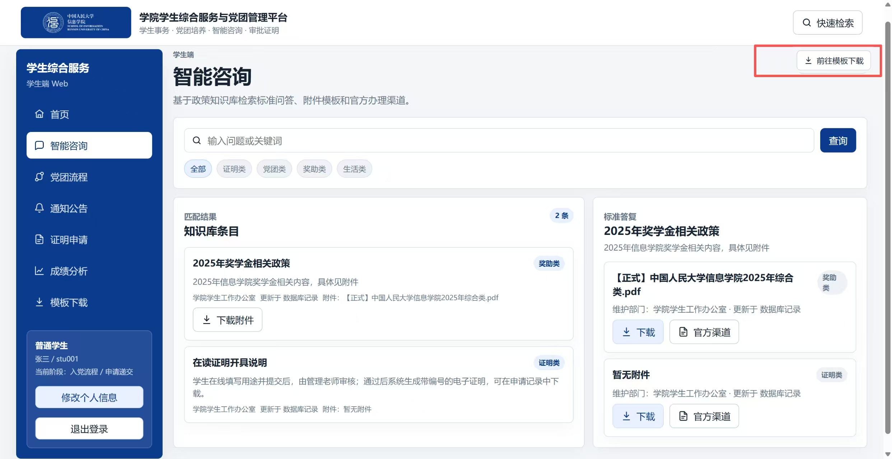

# 学院学生综合服务与党团管理平台学生端基本功能文档与使用说明

版本：V1.0  
适用对象：学生用户、测试人员  
说明：本文件仅整理学生端当前版本的实际功能与使用路径，管理员端说明由其他文档单独编写。

---

## 1. 文档说明

### 1.1 编写目的
本文档用于说明“学院学生综合服务与党团管理平台”学生端的访问方式、测试账号、主要功能、操作步骤、页面效果及当前版本说明，便于测试、演示和日常使用时查阅。

### 1.2 文档范围
本文档覆盖学生端当前可见和已验证的主要流程，包括：

- 登录与注册入口
- 学生端首页总览
- 个人信息维护
- 智能咨询
- 党团流程
- 通知公告
- 证明申请
- 成绩分析
- 模板下载

### 1.3 使用说明
- 本文档中的截图均来自当前测试环境。
- 文中操作路径以当前实际页面为准。
- 若后续版本调整了页面名称、按钮文案或功能位置，应同步更新本文档。

---

## 2. 访问方式与测试账号

### 2.1 访问地址
- 系统访问地址：[`http://10.10.0.24:3000/`](http://10.10.0.24:3000/)

### 2.2 测试账号
- 学生账号：`stu001`
- 学生密码：`123456`
- 管理员账号：`admin001`
- 管理员密码：`123456`

说明：本文档主要说明学生端流程，管理员账号仅用于说明系统支持角色切换测试。

---

## 3. 登录与注册

### 3.1 功能说明
系统提供登录入口，并支持按照页面提示进行注册。使用测试账号登录后，可直接进入学生端首页并体验后续功能。

### 3.2 操作步骤
1. 打开系统首页。
2. 在登录页输入测试账号和密码。
3. 点击“登录”进入系统。
4. 如需测试注册流程，可点击注册入口，填写角色、学号或工号、姓名及密码后提交。

### 3.3 页面说明

上图展示了系统的登录与注册入口页面。页面中的灰色文字可作为测试账号提示使用；`stu001` 对应学生端，`admin001` 对应管理员端。页面中的注册入口用于模拟真实场景下的新用户注册，注册完成后可以使用新账号重新登录系统。

### 3.4 预期结果
- 输入正确账号和密码后，系统应成功进入学生端首页。
- 注册信息填写完整时，系统应允许完成注册流程。

### 3.5 注意事项
- 若登录失败，应优先检查账号、密码和访问地址是否正确。
- 若页面无法正常加载，建议刷新页面或检查后端服务状态。

---

## 4. 学生端首页总览

### 4.1 功能说明
学生登录后进入首页。首页用于集中展示学生端各功能模块入口，包括智能咨询、党团流程、通知公告、证明申请、成绩分析和模板下载等内容。

### 4.2 页面说明

上面两张图均为学生端主页截图，只是展示了首页上下滚动后看到的不同分块内容。学生登录后进入首页，可通过滚动查看不同功能模块。

### 4.3 预期结果
- 首页应正常加载。
- 左侧导航栏和各模块入口应显示完整。
- 点击不同模块后应能够跳转到对应页面。

---

## 5. 个人信息维护

### 5.1 功能说明
学生可通过个人信息维护入口修改个人基础信息，如姓名、学号、年级、专业等。部分信息会影响后续页面中的展示或通知推送效果。

### 5.2 操作步骤
1. 在学生端页面点击“修改个人信息”。
2. 进入个人信息维护页面。
3. 修改姓名、学号、年级、专业等字段。
4. 提交保存。

### 5.3 页面说明

点击“修改个人信息”按钮后，学生可及时修改自己的姓名、学号等信息。当前测试账号下所选的年级、专业等字段会影响部分学生端页面的数据匹配，例如通知定向推送等。

### 5.4 预期结果
- 页面可正常展示个人资料。
- 修改后系统应保存更新结果，并在刷新后保持一致。

### 5.5 注意事项
- 建议填写真实、完整的信息，以便后续功能测试更加接近实际使用场景。

---

## 6. 智能咨询

### 6.1 功能说明
“智能咨询”模块用于根据关键词检索知识库条目，帮助学生查看政策说明、材料要求、办理提示和关联附件信息。该模块与管理员端“知识库管理”模块为前台查询和后台维护的对应关系。

### 6.2 操作步骤
1. 在左侧导航中点击“智能咨询”。
2. 在搜索框中输入关键词，例如“奖学金”“在读证明”等。
3. 根据需要点击分类标签进行筛选。
4. 查看命中的知识库条目和右侧标准答复区域。
5. 如有需要，可点击“前往模板下载”进入模板下载模块。

### 6.3 页面说明

该图展示了学生端“智能咨询”页面。学生可根据关键词检索知识库条目，右侧标准答复区域会展示命中条目的说明内容。页面右上角“前往模板下载”按钮用于跳转到模板下载模块，获取与当前业务相关的模板文件，例如“奖学金申请表”等。

### 6.4 当前版本说明
- “智能咨询”面向学生提供查询入口。
- “知识库管理”面向管理员维护数据内容。
- 页面中的“官方渠道”按钮当前用于复制官方渠道说明编号。若点击后出现提示但未复制到有效编号，属于当前测试版本的正常现象，不影响主流程测试。

### 6.5 预期结果
- 输入关键词后，系统应返回相关知识条目。
- 页面应正常展示标题、分类、说明文本和附件相关信息。
- 点击“前往模板下载”后应进入模板下载页面。

---

## 7. 党团流程

### 7.1 功能说明
“党团流程”模块用于展示学生在入党或入团培养过程中的节点状态，并支持按当前节点提交材料、保存草稿、查看时间要求和浏览历史记录。

### 7.2 操作步骤
1. 在左侧导航中点击“党团流程”。
2. 根据页面上方切换项选择入党流程或入团流程。
3. 查看当前激活节点及其状态。
4. 在右侧表单中确认当前节点、选择材料类型并填写说明。
5. 查看当前节点的开始与截止时间。
6. 上传附件后点击“提交审核”，或先点击“保存草稿”。
7. 继续向下滚动，查看待处理材料与历史记录。

### 7.3 页面说明

图中为党团流程材料提交页面。学生需要根据当前节点要求选择材料类型、填写说明并上传附件，再按需执行提交审核或保存草稿。页面会直接显示当前节点的开始与截止时间。

若当前节点已经超过截止时间，页面会显示对应提示，用于提醒当前节点不可继续提交。

页面下滑后可看到待处理材料与历史记录模块，用于查看流程历史和操作留痕。

### 7.4 当前版本说明
- 学生端只能围绕当前阶段节点进行材料操作，页面不会再自由切换到未解锁节点。
- 当节点已超过截止时间时，系统会显示提示信息。
- “保存草稿”和“提交审核”按钮均已提供交互入口，测试时应重点关注页面展示、材料填写、附件上传和提示反馈是否正常。

### 7.5 预期结果
- 页面应显示流程节点、当前状态和材料提交区域。
- 当前节点有时间限制时，应正常展示开始与截止时间。
- 超过截止时间时，应显示提示信息。
- 页面下方应能查看相关记录内容。

---

## 8. 通知公告

### 8.1 功能说明
“通知公告”模块用于查看管理员发布的通知信息。学生可按分类筛选通知、查看通知简介，并进入详情页阅读完整内容。

### 8.2 操作步骤
1. 在左侧导航中点击“通知公告”。
2. 查看通知列表。
3. 根据需要点击分类标签进行筛选。
4. 点击某条通知进入详情页面。
5. 如有需要，可执行“全部已读”操作。

### 8.3 页面说明

通知公告页面会展示管理员发布的通知。学生可以按分类筛选查看，也可以进入详情页阅读完整内容。通知在查看详情后会更新为已读状态，“全部已读”可用于批量清理当前范围内的未读提示。

### 8.4 预期结果
- 通知列表应正常显示。
- 点击通知后应打开详情。
- 已读和未读状态应随查看操作发生变化。

---

## 9. 证明申请

### 9.1 功能说明
“证明申请”模块用于展示学生近一年的申请留痕，并支持新建申请、查看记录和维护相关个人资料。

### 9.2 操作步骤
1. 在左侧导航中进入“证明申请”。
2. 查看当前已有的申请记录。
3. 点击“个人信息维护”时，可跳转到个人信息修改页面。
4. 点击“新建申请”，进入申请填写与上传页面。
5. 填写相关内容并上传材料后提交。

### 9.3 页面说明

证明申请页面会展示近一年审批留痕。点击“新建申请”后，系统会跳转到新的申请填写页面，学生可在此输入申请用途并上传相关材料。

### 9.4 预期结果
- 申请记录列表应正常展示。
- 新建申请页面应支持填写和上传。
- 提交后应能在申请记录中看到对应数据或状态更新。

### 9.5 注意事项
- 证明申请中的“个人信息维护”入口与首页的个人信息修改功能相互联通。

---

## 10. 成绩分析

### 10.1 功能说明
“成绩分析”模块用于上传成绩文件并查看系统给出的分析记录和结果。

### 10.2 操作步骤
1. 在左侧导航中点击“成绩分析”。
2. 查看成绩分析首页。
3. 按页面提示上传成绩文件，例如 CSV 文件。
4. 查看系统生成的分析记录和结果展示。

### 10.3 页面说明

上图为成绩分析模块首页。

学生可在该页面上传 CSV 等格式的成绩文件。上传后页面会生成记录并显示结果。

### 10.4 当前版本说明
当前版本中，成绩文件上传与记录展示流程可以正常体验，但解析功能尚未完全实现，因此可能出现“缺失模块”或“学分达成度”与文件内容暂时不完全匹配的情况。这属于当前测试版本的已知现象。

### 10.5 预期结果
- 页面应可正常打开。
- 上传后应生成记录。
- 分析结果区域应有对应展示。

---

## 11. 模板下载

### 11.1 功能说明
“模板下载”模块用于集中下载业务相关模板文件，是学生获取真实模板的主要入口。

### 11.2 操作步骤
1. 在左侧导航中点击“模板下载”。
2. 查看当前可下载的模板列表。
3. 点击目标模板的下载按钮。
4. 观察浏览器下载结果和页面提示。

### 11.3 页面说明

模板下载页面用于集中提供业务模板。点击下载后即可获取相应模板文件，页面会出现“模板下载成功”提示。

### 11.4 预期结果
- 模板列表应正常显示。
- 点击下载后应成功获取文件。
- 页面应给出对应的成功提示。

### 11.5 补充说明
智能咨询中的相关模板提示主要用于帮助学生找到业务入口；如需获取真实模板文件，应以本模块中的下载结果为准。

---

## 12. 常见说明

### 12.1 关于测试数据
当前页面中的部分内容依赖测试环境预置数据，因此不同账号下显示的通知、流程、申请记录和知识条目可能有所差异。

### 12.2 关于演示型交互
学生端个别按钮在当前测试版本中仍可能保留提示性或说明性作用。测试时应优先关注页面主流程是否完整、跳转是否正确以及核心模块是否可用。

### 12.3 关于文档适用范围
本文档仅对应学生端当前版本。若系统后续新增功能或调整页面文案，应重新更新本手册。

---

## 13. 学生端功能流程概览

根据当前测试路径，学生端的典型使用流程如下：

1. 打开系统并使用测试账号登录。
2. 进入学生端首页，浏览各模块总览。
3. 按需维护个人信息。
4. 在智能咨询模块中检索政策说明，并在需要时前往模板下载。
5. 在党团流程模块中查看当前节点、填写说明、上传附件并提交或保存草稿。
6. 在通知公告模块中查看管理员发布的通知，并进入详情阅读。
7. 在证明申请模块中查看申请记录或新建申请。
8. 在成绩分析模块中上传成绩文件并查看分析记录。
9. 在模板下载模块中下载业务模板。

以上流程即为当前学生端的主要使用路径，也是本文档所对应的测试与说明顺序。
