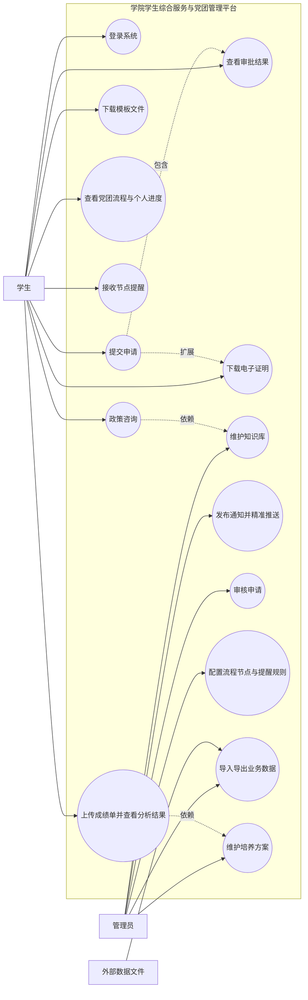
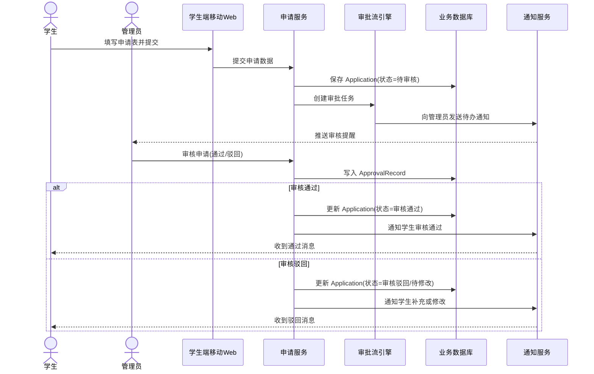
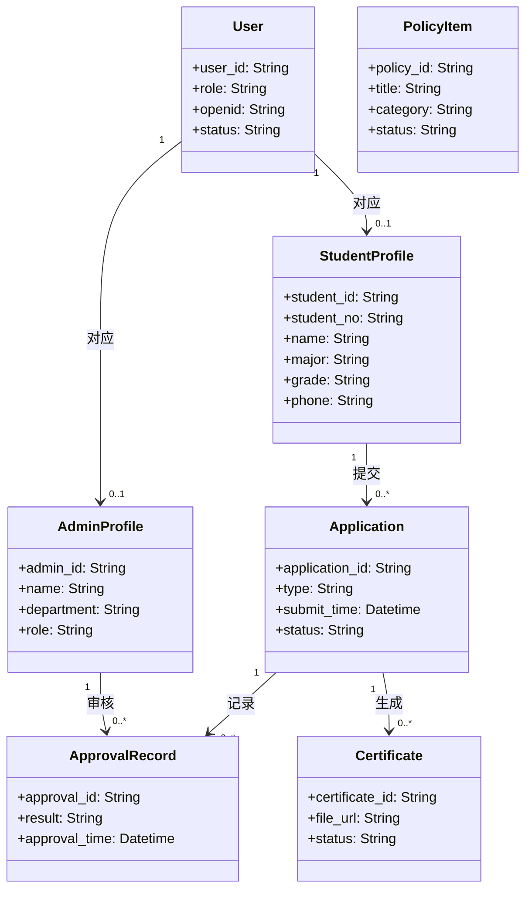
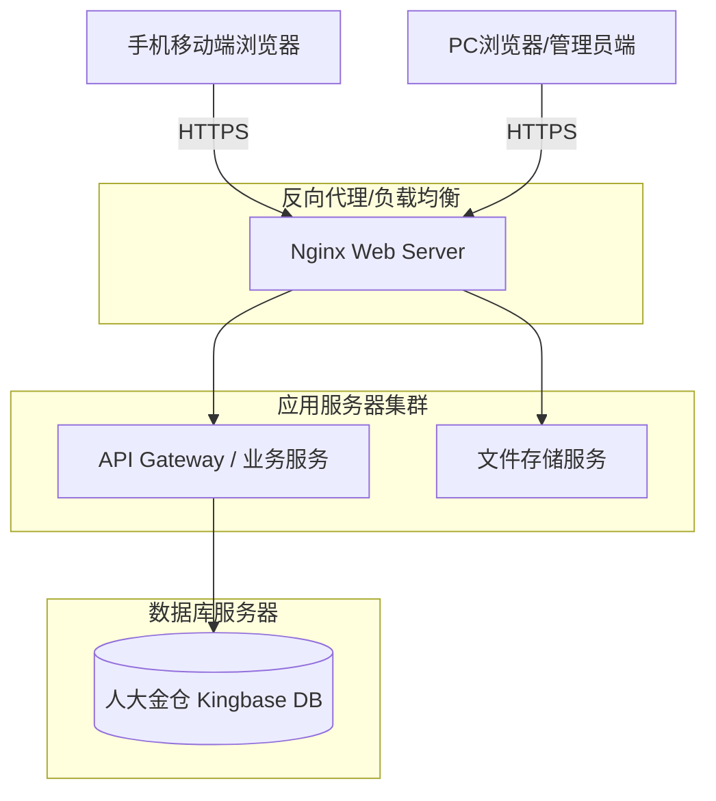

**文档编号：学院学生综合服务与党团管理平台 -- SDS -- 1.0**

**学院学生综合服务与党团管理平台**

**软件设计规格说明书**

**日期：2026年5月12日**

\
**文档变更历史记录**

| 序号 | 变更日期 | 变更人员 | 变更内容详情描述 | 版本 |
|------|----------|----------|------------------|------|
| 1    |    2026.5.12      |       钟晓懿   |        初始版本 | 1.0 |
| 2    |          |          |                  |      |
| 3    |          |          |                  |      |
| 4    |          |          |                  |      |
| 5    |          |          |                  |      |
| 6    |          |          |                  |      |
| 7    |          |          |                  |      |
| 8    |          |          |                  |      |
| 9    |          |          |                  |      |
| 10   |          |          |                  |      |

**目录**

- [1、引言](#1引言)
  - [1.1 编写目的](#11编写目的)
  - [1.2 读者对象](#12读者对象)
  - [1.3 软件项目概述](#13软件项目概述)
  - [1.4 文档概述](#14文档概述)
  - [1.5 定义](#15定义)
  - [1.6 参考资料](#16参考资料)
- [2、软件设计约束](#2软件设计约束)
  - [2.1 软件设计目标和原则](#21软件设计目标和原则)
  - [2.2 软件设计的约束和限制](#22软件设计的约束和限制)
- [3、软件设计](#3软件设计)
  - [3.1 软件体系结构设计](#31软件体系结构设计)
  - [3.2 用户界面设计](#32用户界面设计)
  - [3.3 用例设计](#33用例设计)
  - [3.4 类设计](#34类设计)
  - [3.5 数据设计](#35数据设计)
  - [3.6 部署设计](#36部署设计)

# **1、引言** {#1引言}

### 1.1 编写目的 {#11编写目的}

***\<简要说明本文档的编写目的\>***

本文档旨在详细描述“学院学生综合服务与党团管理平台”的软件体系结构、系统接口、数据库设计及各模块的详细设计。本文档将作为系统开发阶段的指导性文件，为后续的编码实现、测试用例编写及系统维护提供明确的技术蓝图。

### 1.2 读者对象 {#12读者对象}

***\<简要说明本文档可能的读者对象\>***

1. 开发团队：彭芊郗，郭心蕾，钟晓懿，刘小渔四人小组。用于指导系统的架构设计与具体编码实现。
2. 测试团队：用于编写测试计划和测试用例，进行系统验收与验证。
3. 项目评审人员及指导老师：用于评估系统架构设计的合理性、可行性以及是否满足软件工程大作业的要求。
4. 学院相关负责老师：用于确认系统设计是否符合学院实际业务的安全与性能需求。

### 1.3 软件项目概述 {#13软件项目概述}

***\<简要说明关于本软件项目的：***

- ***项目名称、简称和代号***

- ***用户单位***

- ***开发单位***

- ***软件项目的大致需求描述：包括功能和性能等等\>***

- **项目名称**：学院学生综合服务与党团管理平台
- **用户单位**：中国人民大学信息学院
- **开发单位**：彭芊郗，郭心蕾，钟晓懿，刘小渔四人小组
- **项目概述**：
  本系统是一个为学院量身打造的“一站式”学生事务与党团管理窗口，采用前后端分离架构，前端包括移动端Web（面向学生，主要在手机端使用）和PC端Web（面向管理员），后端使用人大金仓（Kingbase）数据库进行数据存储。
  系统的核心功能包括：
  1. 智能问答与政策知识库：提供基于政策文件的AI问答与常用模板下载。
  2. 党团事务流程管理：实现党团全过程的可视化追踪、关键节点提醒及完整履历记录。
  3. 信息集成与精准推送：支持基于学生画像的标签化精准通知。
  4. 电子证明生成与审批流程：支持多级审批、自动生成电子证明及盖章。
  5. 学业情况分析与预警：比对培养方案进行成绩分析与选课推荐。
  在性能方面，系统需满足最高300人同时在线并发，支持多级权限体系，确保核心敏感数据（如身份证号、户籍等）加密存储与安全审计。

### 1.4 文档概述 {#14文档概述}

***\<简要说明本文档的大致内容及其组织结构\>***

本文档主要包含以下三个部分：
1. **引言**：介绍文档的编写目的、读者对象、项目概述、专用术语定义及参考资料。
2. **软件设计约束**：阐述软件设计欲达到的目标与原则，并详细列举系统在运行环境、开发语言、工具、性能等方面的约束和限制。
3. **软件设计**：详细描述系统的体系结构、用户界面设计、用例设计、类设计、数据设计及部署设计。

### 1.5 定义 {#15定义}

***\<逐条定义本文档所涉及的专门术语、容易引起歧义的概念、关键词缩写及其他需要解释的内容\>***

1. **SDS (Software Design Specification)**：软件设计规格说明书，用于描述软件的架构、接口和详细设计方案。
2. **知识库**：指由政策文件、标准问答、模板附件等组成的可检索内容集合，用于支持学生咨询。
3. **精准推送**：系统根据学生画像、标签（如“就业”、“实习”等），将信息有针对性地发送给符合条件的用户。
4. **审批流**：学生提交申请后，系统按照预设的层级顺序流转至管理员审核的过程。
5. **Kingbase**：人大金仓数据库，本系统指定的底层关系型数据库。
6. **学生端**：面向学院学生使用的移动端Web网页（Mobile Web），适配手机屏幕尺寸。
7. **管理员端**：面向学院老师、助教等使用的PC Web后台管理系统。

### 1.6 参考资料 {#16参考资料}

***\<以列表或排序的方式给出重要的参考资料的名称、作者、单位、出版日期等信息\>***

1. 《学院学生综合服务与党团管理平台》产品需求文档（demand.md），项目需求提供方
2. 《学院学生综合服务与党团管理平台-软件需求规格说明书》（template.md），开发团队，2026年4月
3. Kingbase数据库官方技术文档，人大金仓

# **2、软件设计约束** {#2软件设计约束}

### 2.1 软件设计目标和原则 {#21软件设计目标和原则}

***\<描述软件设计欲达到的目标，如实现用户需求，软件系统具有良好的可扩充性等等\>***

***\<描述为实现软件设计目标，在设计软件过程中应遵循的一般性设计原则\>***

**软件设计目标：**
1. **功能完备性**：全面覆盖需求文档中定义的党团管理、智能问答、审批证明及学业分析等核心业务闭环。
2. **系统易用性**：学生端采用移动端Web网页形式，无需下载安装，交互简洁；管理员端提供清晰的导航与批量处理能力，降低管理成本。
3. **安全性与保密性**：实现严格的4级权限体系（学院领导、管理老师、班团骨干、普通学生），并对高度敏感信息进行加密存储和操作日志审计。
4. **可扩充性**：采用模块化架构设计，保证后续可灵活接入出国申请、评奖评优细则等新功能模块。

**一般性设计原则：**
1. **高内聚低耦合原则**：各业务模块（如党团流程、信息推送、审批流）相互独立，通过统一定义的API进行交互。
2. **前后端分离原则**：前端专注于界面展示与用户交互，后端专注于业务逻辑和数据处理。
3. **健壮性原则**：在异常操作或高并发（如日均数倍峰值）情况下，系统能够提供友好的错误提示，并保证核心数据的一致性。
4. **数据驱动原则**：业务流程（如党团阶段、审批节点）尽量可配置化，减少硬编码，提高系统对政策变动的适应性。

### 2.2 软件设计的约束和限制 {#22软件设计的约束和限制}

***\<列举和描述软件设计需要考虑的约束和限制***

- ***运行环境要求：硬件平台、OS***

- ***开发语言***

- ***标准规范***

- ***开发工具***

- ***容量和性能要求***

- ***灵活性和配置要求，等等\>***

- **运行环境要求**：
  - 前端（学生）：手机移动端浏览器（Safari/Chrome等）或微信内置浏览器。
  - 前端（管理员）：主流现代PC浏览器（Chrome、Edge等）。
  - 后端服务：Linux/Windows 服务器环境。
- **数据库约束**：必须采用国产人大金仓（Kingbase）数据库进行数据存储。
- **开发语言与技术栈**：前后端分离开发（如前端采用Vue/React等主流响应式Web框架；后端可采用Java/Python/Go等常见Web框架开发，视开发团队技术栈而定）。
- **容量和性能要求**：
  - 预估最大同时在线并发约300人（其中管理人员约10人）。
  - 支持较大文件的批量导入与导出，单次上传文件大小限制约为30MB。
  - 审批记录至少保存1年。
- **外部系统交互约束**：暂无法直接对接校级“微人大”系统接口，数据同步依赖人工通过Excel/Word/PDF批量导入导出。对于学校官方办理的事项，仅提供说明和外链引导。
- **安全性约束**：用户身份验证基于微信账号实名制，且需建立严格的权限控制与操作日志记录系统。

# **3、软件设计** {#3软件设计}

### 3.1 软件体系结构设计 {#31软件体系结构设计}

***\<详细描述软件系统的体系结构设计，可以采用包图描述体系结构的逻辑模型，并提供必要的文字补充说明\>***

本系统采用经典的分层架构和前后端分离设计模式，逻辑模型自上而下分为：
1. **表现层（UI）**：
   - 学生端（移动端Web）：负责学生侧的政策查询、流程查看、申请提交等交互，主要适配手机屏幕。
   - 管理员端（PC Web）：负责教师侧的知识库维护、审批处理、数据统计等交互，适配大屏操作。
2. **业务逻辑层（BLL）**：
   - 包含系统的核心服务模块：用户认证服务、智能问答服务、党团流程服务、通知推送服务、审批流服务、电子证明服务和学业分析服务。
3. **数据访问层（DAL）**：
   - 负责与底层人大金仓（Kingbase）数据库的交互，执行数据的增删改查操作，并处理外部文件的导入导出。

### 3.2 用户界面设计 {#32用户界面设计}

***\<给出软件用户界面的设计模型，包括用户界面的设计类图、描述界面跳转关系的顺序图等，用户界面的原型，并提供必要的文字补充说明\>***

系统的用户界面分为学生端和管理员端，详细界面设计已输出为SVG原型文件：
- **学生端移动Web原型**（参考原 `student-miniapp-prototype.svg` 调整适配浏览器）：
  - 首页：蓝白配色的学院风，提供常用功能入口（如党团流程、智能咨询等）。
  - 党团流程页：线性可视化展示入党/入团全过程及当前进度。
  - 成绩分析页：提供成绩单上传与解析功能。
- **管理员端后台原型**（参考 `admin-web-prototype.svg`）：
  - 采用典型的“左侧导航+顶部面包屑+主内容区”布局。
  - 包含首页、用户管理、知识库管理、流程配置、审批管理、模板管理和培养方案维护等模块。

### 3.3 用例设计 {#33用例设计}

***\<给出各个用例的设计模型，包括描述用例实现的顺序图、用例实现的设计类图等，并提供必要的文字补充说明\>***

以下为系统的核心用例设计模型，包含总用例图与部分核心业务的顺序图。

**系统用例图**：

**申请审批顺序图**：

### 3.4 类设计 {#34类设计}

***\<给出各个类的实现模型，包括详细描述各个类的可见范围、类的属性和方法，给出精化后的类图，描述类方法的活动图，类对象的状态图等，并提供必要的文字补充说明\>***

以下为系统精化后的核心分析类图：

### 3.5 数据设计 {#35数据设计}

***\<给出软件系统中永久数据的设计模型，包括描述数据库及表的设计类图，描述数据操作的活动图、必须提供必要的文字补充说明\>***

本系统底层指定使用人大金仓（Kingbase）数据库。根据类图设计，主要数据表包括：
1. **用户及权限类表**：`sys_user`（统一用户表）、`student_profile`（学生信息表）、`admin_profile`（管理员信息表）。
2. **知识库与通知类表**：`policy_item`（政策文件表）、`notice`（通知表）。
3. **流程与审批类表**：`application`（申请单表）、`approval_record`（审批记录表）、`party_process_node`（党团流程节点配置表）。
4. **教务辅助类表**：`training_plan`（培养方案表）、`transcript_task`（成绩分析任务表）。

### 3.6 部署设计 {#36部署设计}

***\<用部署图描述目标软件系统的部署设计，提供必要的文字补充说明\>***

系统的部署架构设计如下：

部署说明：
- 客户端通过 HTTPS 协议访问服务器。
- Nginx 作为反向代理处理静态资源请求（如证明模板、前台图片）并转发动态 API 请求。
- 应用服务处理核心业务逻辑。
- 数据库独立部署以确保数据安全与高可用。
