**文档编号：学院学生综合服务与党团管理平台 -- SDS -- 1.0**

**学院学生综合服务与党团管理平台**

**软件设计规格说明书**

**日期：2026年5月15日**

**文档变更历史记录**

| 序号 | 变更日期      | 变更人员 | 变更内容详情描述       | 版本  |
| -- | --------- | ---- | -------------- | --- |
| 1  | 2026.5.12 | 钟晓懿  | 初始版本           | 1.0 |
| 2  | 2026.5.12 | 彭芊郗  | 完成了引言部分        | 1.1 |
| 3  | 2026.5.13 | 彭芊郗  | 完善了软件设计约束的部分内容 | 1.2 |
| 4  | 2026.5.14 | 刘小渔  | 补充类设计缺失图表      | 1.3 |
| 5  | 2026.5.14 | 刘小渔  | 优化系统逻辑架构图渲染    | 1.4 |
| 6  | 2026.5.14 | 刘小渔  | 修正原型图与活动图渲染    | 1.5 |
| 7  | 2026.5.15 | 郭心蕾  | 将设计文档同步调整为 Web 网页系统并导出模板格式 Word | 1.6 |

**目录**

- [1、引言](#1引言)
  - [1.1 编写目的](#11编写目的)
  - [1.2 读者对象](#12读者对象)
  - [1.3 软件项目概述](#13软件项目概述)
  - [1.4 文档概述](#14文档概述)
  - [1.5 定义](#15定义)
  - [1.6 参考资料](#16参考资料)
- [2、软件设计约束](#2软件设计约束)
  - [2.1 软件设计目标和原则](#21软件设计目标和原则)
  - [2.2 软件设计的约束和限制](#22软件设计的约束和限制)
- [3、软件设计](#3软件设计)
  - [3.1 软件体系结构设计](#31软件体系结构设计)
  - [3.2 用户界面设计](#32用户界面设计)
  - [3.3 用例设计](#33用例设计)
  - [3.4 类设计](#34类设计)
  - [3.5 数据设计](#35数据设计)
  - [3.6 部署设计](#36部署设计)

# **1、引言** {#1引言}

### 1.1 编写目的 {#11编写目的}

本文档作为“学院学生综合服务与党团管理平台”的软件设计规格说明书（SDS），其编写目的是在《软件需求规格说明书》（SRS）的基础上，对系统进行概要设计与详细设计。文档详细描述了系统的技术架构、界面逻辑、用例实现过程、类结构、数据库物理设计及部署方案，旨在为开发小组提供明确的编码指引，为测试团队提供系统验证依据，并确保最终实现的软件能够准确满足学院学生事务管理的需求。

本文档旨在详细描述“学院学生综合服务与党团管理平台”的软件体系结构、系统接口、数据库设计及各模块的详细设计。本文档将作为系统开发阶段的指导性文件，为后续的编码实现、测试用例编写及系统维护提供明确的技术蓝图。

### 1.2 读者对象 {#12读者对象}

1. **开发团队**：彭芊郗、郭心蕾、钟晓懿、刘小渔四人小组，负责根据本文档完成前后端编码与系统集成。
2. **测试团队**：负责根据设计逻辑编写集成测试用例，验证系统功能与性能指标的达成情况。
3. **项目评审人员**：包括课程老师、助教及评审同学，用于评估系统设计的规范性、合理性与可实现性。
4. **用户单位管理人员**：中国人民大学信息学院相关负责人，用于了解系统的技术实现框架与安全保障机制。

### 1.3 软件项目概述 {#13软件项目概述}

- **项目名称**：学院学生综合服务与党团管理平台
- **项目简称**：学生综合服务平台
- **用户单位**：中国人民大学信息学院
- **开发单位**：彭芊郗、郭心蕾、钟晓懿、刘小渔四人小组
- **软件项目的大致需求描述**：
- **功能需求**：系统核心功能包括基于知识库的智能咨询、党团培养全过程的可视化追踪、基于学生标签的精准通知推送、在读证明等电子文件的自动生成与审批流处理，以及学业成绩分析与选课建议功能。
- **性能需求**：系统需支持全院约 1200\~1300 人用户规模，关键节点（如奖学金申请集中期）并发访问量需达到 300 人左右，常规查询响应时间应控制在 2 秒内。

### 1.4 文档概述 {#14文档概述}

本文档共分为三个主要章节：

1. **引言**：定义文档目的、读者、项目背景、专业术语及参考资料。
2. **软件设计约束**：明确软件设计的目标原则，以及受到的运行环境、安全性、权限等方面的限制。
3. **软件设计**：详细描述软件的体系结构、用户界面、用例实现、精化类图、数据库物理设计及部署图。

### 1.5 定义 {#15定义}

1. **SDS**：Software Design Specification，软件设计规格说明书。
2. **SRS**：Software Requirements Specification，软件需求规格说明书。
3. **Kingbase**：人大金仓数据库管理系统，为本项目指定的后端数据库。
4. **学生端**：基于 Web 的前端应用，适配移动端与PC端浏览器，面向学生提供综合服务。
5. **管理员端**：基于 Web 的 PC 后台管理系统，面向老师及管理人员。
6. **审批流**：学生提交申请后，经系统按照既定顺序流转至管理员审核的业务过程。
7. **智能问答**：系统基于政策知识库内容进行关键词检索或相似匹配提供的咨询服务。
8. **知识库**：指由政策文件、标准问答、模板附件等组成的可检索内容集合，用于支持学生咨询。
9. **精准推送**：系统根据学生画像、标签（如“就业”、“实习”等），将信息有针对性地发送给符合条件的用户。

### 1.6 参考资料 {#16参考资料}

1. 《学院学生综合服务与党团管理平台软件需求规格说明书》，版本 V09，开发小组编写。
2. 《学院学生综合服务与党团管理平台》产品需求文档。
3. W3C Web 前端开发相关标准与规范文档。
4. Kingbase 数据库技术参考手册，人大金仓发布。
5. 学院现行学生事务、党团管理制度及办事流程相关材料。

# **2、软件设计约束** {#2软件设计约束}

### 2.1 软件设计目标和原则 {#21软件设计目标和原则}

**软件设计目标：**

1. **功能完备性**：全面覆盖需求文档中定义的党团管理、智能问答、审批证明及学业分析等核心业务闭环。
2. **系统易用性**：学生端采用 Web 网页形式（适配移动端与PC端），无需下载安装，交互简洁；管理员端提供清晰的导航与批量处理能力，降低管理成本。
3. **安全性与保密性**：实现严格的4级权限体系（学院领导、管理老师、班团骨干、普通学生），并对高度敏感信息进行加密存储和操作日志审计。
4. **可扩充性**：采用模块化架构设计，保证后续可灵活接入出国申请、评奖评优细则等新功能模块。

**一般性设计原则：**

1. **高内聚低耦合原则**：各业务模块（如党团流程、信息推送、审批流）相互独立，通过统一定义的API进行交互。
2. **前后端分离原则**：前端专注于界面展示与用户交互，后端专注于业务逻辑和数据处理。
3. **健壮性原则**：在异常操作或高并发（如日均数倍峰值）情况下，系统能够提供友好的错误提示，并保证核心数据的一致性。
4. **数据驱动原则**：业务流程（如党团阶段、审批节点）尽量可配置化，减少硬编码，提高系统对政策变动的适应性。

### 2.2 软件设计的约束和限制 {#22软件设计的约束和限制}

- **运行环境要求：硬件平台、OS**
  - **前端（学生端与管理员端）**：采用 Web 网页形式（适配移动端与 PC 端），需兼容主流现代浏览器（Chrome、Safari、Edge 等）。
  - **后端服务**：部署于 Linux/Windows 服务器环境。
  - **数据库**：必须采用国产人大金仓（Kingbase）数据库进行数据存储。
- **开发语言**
  - 采用前后端分离开发（前端采用 Vue/React 等主流响应式 Web 框架；后端采用 Java/Python/Go 等常见 Web 框架开发，视开发团队技术栈而定）。
- **标准规范**
  - W3C Web 前端开发相关标准与规范。
  - HTTP/HTTPS 协议及 RESTful API 接口规范。
- **开发工具**
  - 前端开发工具：VS Code、WebStorm 等。
  - 后端开发工具：IntelliJ IDEA、PyCharm、GoLand 等。
  - 数据库管理工具：人大金仓数据库开发管理工具。
- **容量和性能要求**
  - 预估最大同时在线并发约 300 人（其中管理人员约 10 人）。
  - 常规查询响应时间应控制在 2 秒内，首次加载时间不超过 3 秒。
  - 支持较大文件的批量导入与导出，单次上传文件大小限制约为 30MB。
  - 审批记录至少保存 1 年。
- **灵活性和配置要求**
  - **外部系统交互**：暂无法直接对接校级“微人大”系统接口，数据同步依赖人工通过 Excel/Word/PDF 批量导入导出。对于学校官方办理的事项，仅提供说明和外链引导。
  - **安全与权限控制**：需建立严格的 4 级权限体系（学院领导、管理老师、班团骨干、普通学生）。用户身份验证基于统一身份认证系统或账号密码登录，并需建立操作日志记录系统。
  - **业务配置**：智能问答以知识库检索为准，业务流程需适配现行制度并支持参数化配置。

# **3、软件设计** {#3软件设计}

### 3.1 软件体系结构设计 {#31软件体系结构设计}

本系统采用经典的分层架构和前后端分离设计模式，逻辑模型自上而下分为：

1. **表现层（UI）**：
   - 学生端（移动端Web）：负责学生侧的政策查询、流程查看、申请提交等交互，主要适配手机屏幕。
   - 管理员端（PC Web）：负责教师侧的知识库维护、审批处理、数据统计等交互，适配大屏操作。
2. **业务逻辑层（BLL）**：
   - 包含系统的核心服务模块：用户认证服务、智能问答服务、党团流程服务、通知推送服务、审批流服务、电子证明服务和学业分析服务。
3. **数据访问层（DAL）**：
   - 负责与底层人大金仓（Kingbase）数据库的交互，执行数据的增删改查操作，并处理外部文件的导入导出。

系统体系结构总览图如下。该图概括展示系统从表现层、业务逻辑层到数据访问层和基础设施的整体分层关系。

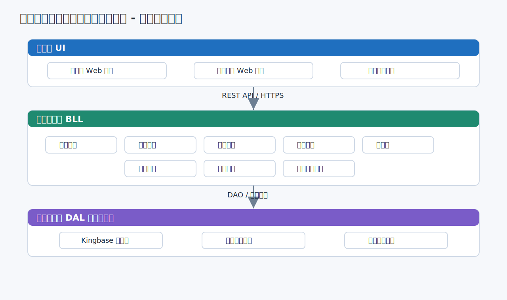

图 3-1 软件体系结构总览图

系统逻辑架构图如下。图中的 API 网关、服务和 DAO 均表示逻辑职责划分，不限定具体开发框架；实际实现时可根据开发团队技术栈合并或拆分为对应模块。本图重点回答“系统按什么职责分层”，不强调服务器部署位置；具体部署关系见 3.6 节。

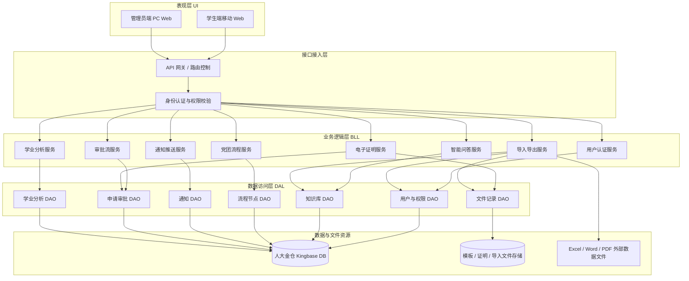
```mermaid
flowchart TB
    subgraph Client[表现层 UI]
        StudentWeb[学生端移动 Web]
        AdminWeb[管理员端 PC Web]
    end

    subgraph Gateway[接口接入层]
        ApiGateway[API 网关 / 路由控制]
        AuthFilter[身份认证与权限校验]
    end

    subgraph Service[业务逻辑层 BLL]
        AuthService[用户认证服务]
        PolicyService[智能问答服务]
        ProcessService[党团流程服务]
        NoticeService[通知推送服务]
        ApplicationService[审批流服务]
        CertificateService[电子证明服务]
        AnalysisService[学业分析服务]
        ImportExportService[导入导出服务]
    end

    subgraph DataAccess[数据访问层 DAL]
        UserDAO[用户与权限 DAO]
        PolicyDAO[知识库 DAO]
        ProcessDAO[流程节点 DAO]
        NoticeDAO[通知 DAO]
        ApplicationDAO[申请审批 DAO]
        FileDAO[文件记录 DAO]
        AnalysisDAO[学业分析 DAO]
    end

    subgraph Storage[数据与文件资源]
        Kingbase[(人大金仓 Kingbase DB)]
        FileRepo[(模板 / 证明 / 导入文件存储)]
        ExternalFiles[Excel / Word / PDF 外部数据文件]
    end

    StudentWeb --> ApiGateway
    AdminWeb --> ApiGateway
    ApiGateway --> AuthFilter
    AuthFilter --> AuthService
    AuthFilter --> PolicyService
    AuthFilter --> ProcessService
    AuthFilter --> NoticeService
    AuthFilter --> ApplicationService
    AuthFilter --> CertificateService
    AuthFilter --> AnalysisService
    AuthFilter --> ImportExportService

    AuthService --> UserDAO
    PolicyService --> PolicyDAO
    ProcessService --> ProcessDAO
    NoticeService --> NoticeDAO
    ApplicationService --> ApplicationDAO
    CertificateService --> ApplicationDAO
    CertificateService --> FileDAO
    AnalysisService --> AnalysisDAO
    ImportExportService --> UserDAO
    ImportExportService --> PolicyDAO
    ImportExportService --> FileDAO

    UserDAO --> Kingbase
    PolicyDAO --> Kingbase
    ProcessDAO --> Kingbase
    NoticeDAO --> Kingbase
    ApplicationDAO --> Kingbase
    AnalysisDAO --> Kingbase
    FileDAO --> FileRepo
    ImportExportService --> ExternalFiles
```

图 3-2 系统逻辑架构图

该结构将界面展示、接口鉴权、业务处理、数据访问和文件资源管理分离。学生端和管理员端均通过统一接口访问后端，后端根据 4 级权限体系控制可访问的数据范围和操作范围；业务数据持久化到 Kingbase，模板文件、生成证明和批量导入文件由文件存储服务统一管理。

### 3.2 用户界面设计 {#32用户界面设计}

系统的用户界面分为学生端和管理员端，详细界面设计已输出为SVG原型文件：

- **学生端移动Web原型**（参考 `需求文档/student-web-prototype.svg` 调整适配浏览器）：
  - 首页：蓝白配色的学院风，提供常用功能入口（如党团流程、智能咨询、通知、申请提交等）。
  - 智能咨询页：支持输入问题或关键词，展示知识库匹配结果、附件链接和官方渠道提示。
  - 党团流程页：线性可视化展示入党/入团全过程及当前进度。
  - 申请与证明页：支持申请提交、审批结果查看、电子证明预览和下载。
  - 成绩分析页：提供成绩单上传与解析功能。
- **管理员端后台原型**（参考 `需求文档/admin-web-prototype.svg`）：
  - 采用典型的“左侧导航+顶部面包屑+主内容区”布局。
  - 包含首页、用户管理、知识库管理、通知管理、流程配置、审批管理、模板管理、培养方案维护和数据导入导出等模块。

学生端界面跳转关系如下：

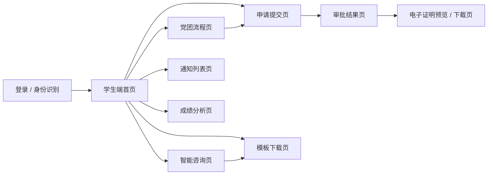
```mermaid
flowchart LR
    Login[登录 / 身份识别]
    Home[学生端首页]
    Policy[智能咨询页]
    Process[党团流程页]
    Notice[通知列表页]
    ApplicationPage[申请提交页]
    Result[审批结果页]
    Certificate[电子证明预览 / 下载页]
    Analysis[成绩分析页]
    Template[模板下载页]

    Login --> Home
    Home --> Policy
    Home --> Process
    Home --> Notice
    Home --> ApplicationPage
    Home --> Analysis
    Home --> Template
    ApplicationPage --> Result
    Result --> Certificate
    Policy --> Template
    Process --> ApplicationPage
```

图 3-3 学生端界面跳转关系图

管理员端界面跳转关系如下：

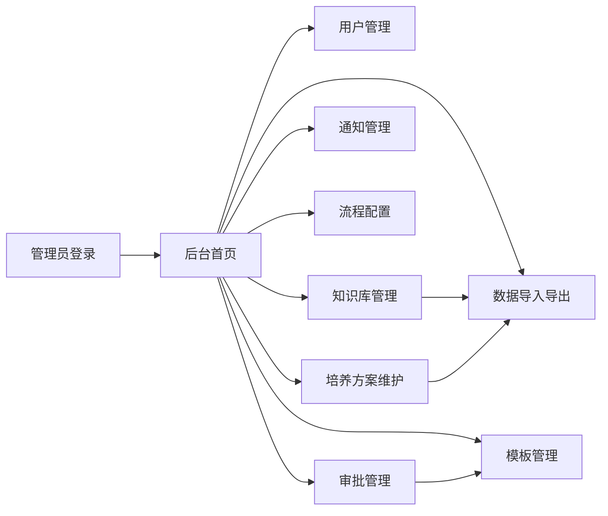
```mermaid
flowchart LR
    AdminLogin[管理员登录]
    Dashboard[后台首页]
    UserManage[用户管理]
    Knowledge[知识库管理]
    NoticeManage[通知管理]
    ProcessConfig[流程配置]
    Approval[审批管理]
    TemplateManage[模板管理]
    TrainingPlan[培养方案维护]
    ImportExport[数据导入导出]

    AdminLogin --> Dashboard
    Dashboard --> UserManage
    Dashboard --> Knowledge
    Dashboard --> NoticeManage
    Dashboard --> ProcessConfig
    Dashboard --> Approval
    Dashboard --> TemplateManage
    Dashboard --> TrainingPlan
    Dashboard --> ImportExport
    Knowledge --> ImportExport
    TrainingPlan --> ImportExport
    Approval --> TemplateManage
```

图 3-4 管理员端界面跳转关系图

学生端移动 Web 原型如下：

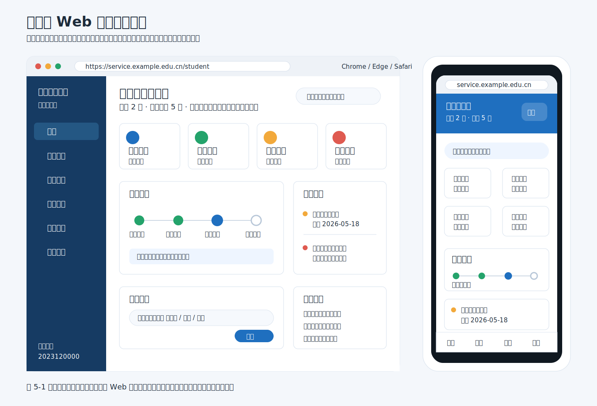

图 3-5 学生端移动 Web 原型

管理员端 PC Web 原型如下：

图 3-6 管理员端后台原型

上述界面图与跳转图共同约束前端设计边界：学生端优先支持查询、申请、提醒和结果查看等高频操作；管理员端优先支持维护、审核、配置和批量数据处理等管理操作。界面实现时应保证同一业务对象在学生端和管理员端的状态一致，例如申请单、通知和证明文件均以数据库状态为准。

### 3.3 用例设计 {#33用例设计}

以下为系统的核心用例设计模型，包含总用例图与部分核心业务的顺序图。

**系统用例图**：

系统用例总览图如下。该图以学生和管理员两类参与者为中心，展示双方围绕平台开展的核心交互。

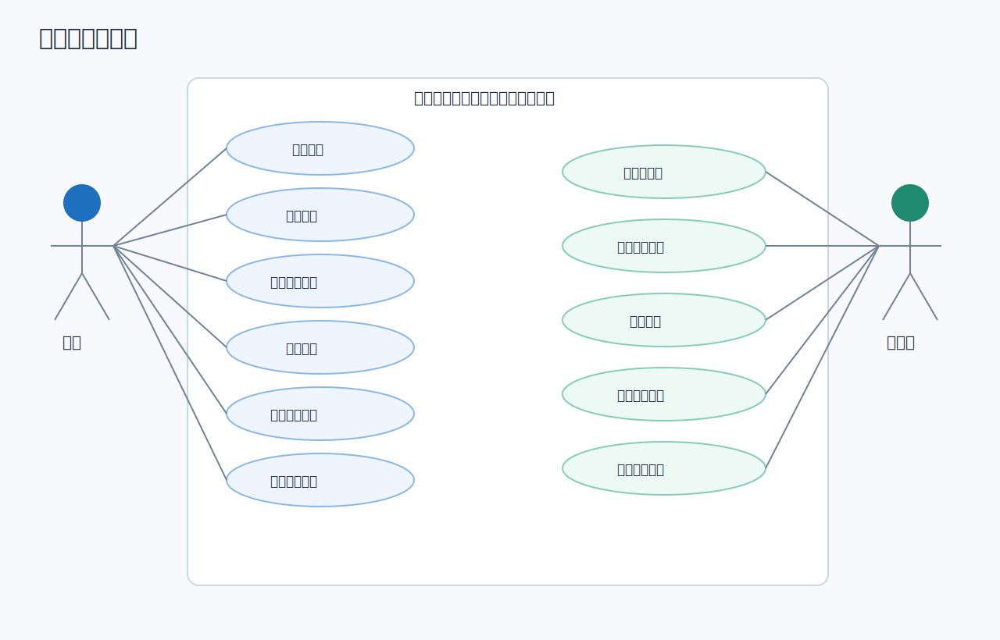

图 3-7 系统用例设计总览图

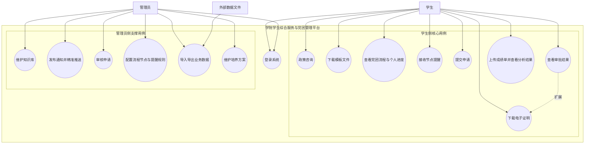
```mermaid
flowchart TB
    student[学生]
    admin[管理员]
    extfile[外部数据文件]

    subgraph system[学院学生综合服务与党团管理平台]
        direction TB
        login((登录系统))

        subgraph studentArea[学生侧核心用例]
            direction LR
            uc2((政策咨询))
            uc3((下载模板文件))
            uc4((查看党团流程与个人进度))
            uc5((接收节点提醒))
            uc6((提交申请))
            uc7((查看审批结果))
            uc8((下载电子证明))
            uc9((上传成绩单并查看分析结果))
        end

        subgraph adminArea[管理员侧支撑用例]
            direction LR
            uc10((维护知识库))
            uc11((发布通知并精准推送))
            uc12((审核申请))
            uc13((配置流程节点与提醒规则))
            uc14((导入导出业务数据))
            uc15((维护培养方案))
        end
    end

    student --> login
    student --> uc2
    student --> uc3
    student --> uc4
    student --> uc5
    student --> uc6
    student --> uc7
    student --> uc8
    student --> uc9

    admin --> login
    admin --> uc10
    admin --> uc11
    admin --> uc12
    admin --> uc13
    admin --> uc14
    admin --> uc15

    extfile --> uc14

    uc7 -. 扩展 .-> uc8
```

图 3-8 系统用例细化图

该细化图保留 Mermaid 绘制方式，以便与文档中的其他图保持一致并便于后续维护。相比之前版本，本图按“学生侧核心用例”和“管理员侧支撑用例”分区布局，减少了大跨度交叉连线，从而改善渲染后的可读性。图中仅保留“查看审批结果”到“下载电子证明”的关键扩展关系；“政策咨询依赖知识库维护”“成绩分析依赖培养方案维护”等支撑关系通过文字说明表达，避免因关系线过多影响图面清晰度。

**政策咨询顺序图**：

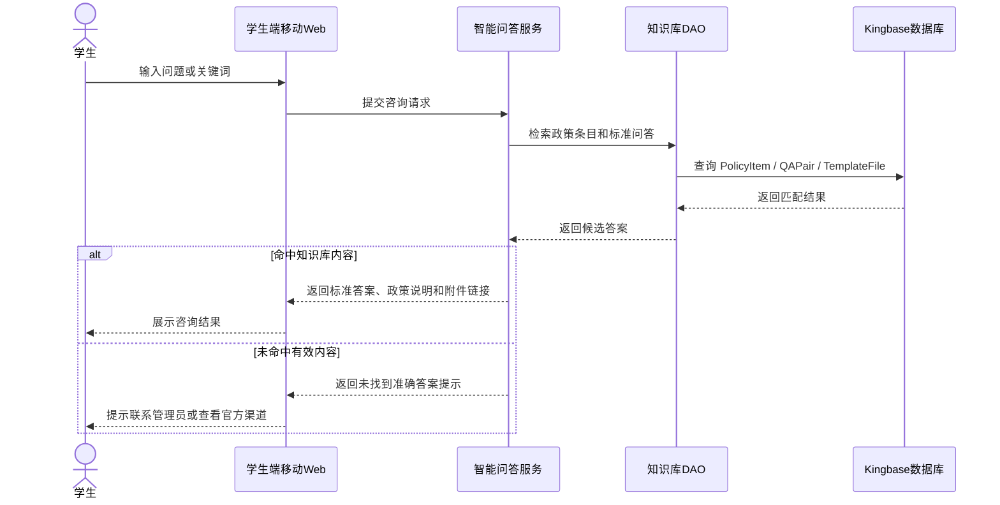
```mermaid
sequenceDiagram
    actor Student as 学生
    participant MobileWeb as 学生端移动Web
    participant PolicyService as 智能问答服务
    participant PolicyDAO as 知识库DAO
    participant DB as Kingbase数据库

    Student->>MobileWeb: 输入问题或关键词
    MobileWeb->>PolicyService: 提交咨询请求
    PolicyService->>PolicyDAO: 检索政策条目和标准问答
    PolicyDAO->>DB: 查询 PolicyItem / QAPair / TemplateFile
    DB-->>PolicyDAO: 返回匹配结果
    PolicyDAO-->>PolicyService: 返回候选答案

    alt 命中知识库内容
        PolicyService-->>MobileWeb: 返回标准答案、政策说明和附件链接
        MobileWeb-->>Student: 展示咨询结果
    else 未命中有效内容
        PolicyService-->>MobileWeb: 返回未找到准确答案提示
        MobileWeb-->>Student: 提示联系管理员或查看官方渠道
    end
```

图 3-9 政策咨询顺序图

**申请审批顺序图**：

申请审批顺序总览图如下。该图突出学生、学生端网页、申请服务、业务数据库和管理员之间的主要消息流。

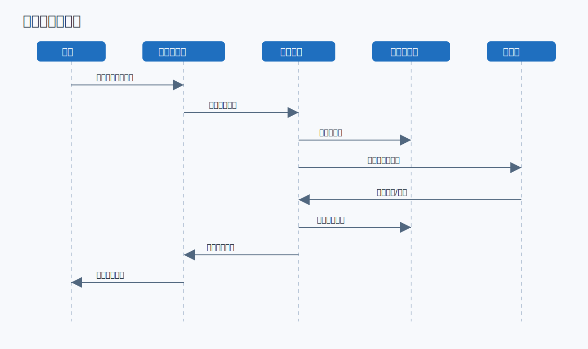

图 3-10 申请审批顺序总览图

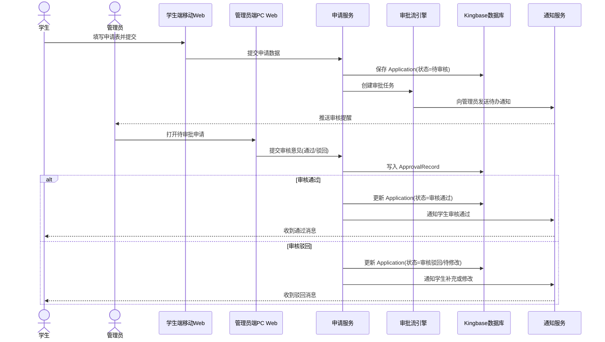
```mermaid
sequenceDiagram
    actor Student as 学生
    actor Admin as 管理员
    participant MobileWeb as 学生端移动Web
    participant AdminWeb as 管理员端PC Web
    participant AppService as 申请服务
    participant Workflow as 审批流引擎
    participant DB as Kingbase数据库
    participant Notify as 通知服务

    Student->>MobileWeb: 填写申请表并提交
    MobileWeb->>AppService: 提交申请数据
    AppService->>DB: 保存 Application(状态=待审核)
    AppService->>Workflow: 创建审批任务
    Workflow->>Notify: 向管理员发送待办通知
    Notify-->>Admin: 推送审核提醒

    Admin->>AdminWeb: 打开待审批申请
    AdminWeb->>AppService: 提交审核意见(通过/驳回)
    AppService->>DB: 写入 ApprovalRecord

    alt 审核通过
        AppService->>DB: 更新 Application(状态=审核通过)
        AppService->>Notify: 通知学生审核通过
        Notify-->>Student: 收到通过消息
    else 审核驳回
        AppService->>DB: 更新 Application(状态=审核驳回/待修改)
        AppService->>Notify: 通知学生补充或修改
        Notify-->>Student: 收到驳回消息
    end
```

图 3-11 申请审批顺序细化图

**电子证明生成顺序图**：

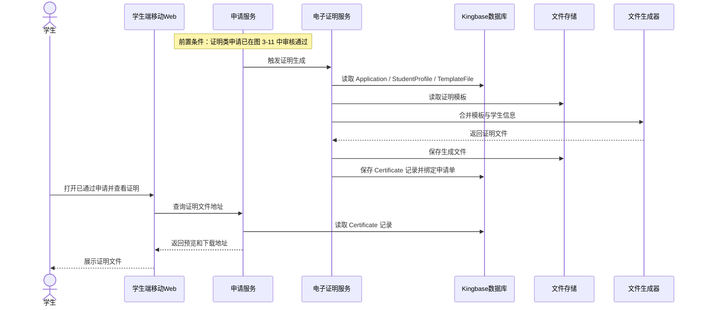
```mermaid
sequenceDiagram
    actor Student as 学生
    participant MobileWeb as 学生端移动Web
    participant AppService as 申请服务
    participant CertService as 电子证明服务
    participant DB as Kingbase数据库
    participant FileRepo as 文件存储
    participant Generator as 文件生成器

    Note over AppService: 前置条件：证明类申请已在图 3-11 中审核通过
    AppService->>CertService: 触发证明生成
    CertService->>DB: 读取 Application / StudentProfile / TemplateFile
    CertService->>FileRepo: 读取证明模板
    CertService->>Generator: 合并模板与学生信息
    Generator-->>CertService: 返回证明文件
    CertService->>FileRepo: 保存生成文件
    CertService->>DB: 保存 Certificate 记录并绑定申请单
    Student->>MobileWeb: 打开已通过申请并查看证明
    MobileWeb->>AppService: 查询证明文件地址
    AppService->>DB: 读取 Certificate 记录
    AppService-->>MobileWeb: 返回预览和下载地址
    MobileWeb-->>Student: 展示证明文件
```

图 3-12 电子证明生成顺序图

**成绩分析顺序图**：

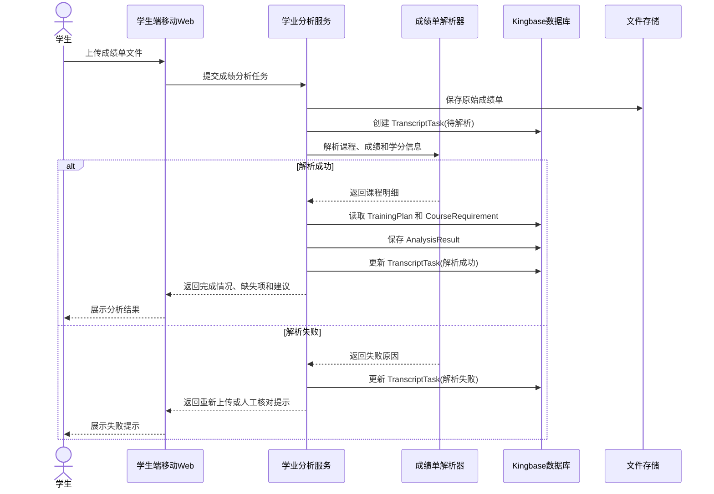
```mermaid
sequenceDiagram
    actor Student as 学生
    participant MobileWeb as 学生端移动Web
    participant AnalysisService as 学业分析服务
    participant Parser as 成绩单解析器
    participant DB as Kingbase数据库
    participant FileRepo as 文件存储

    Student->>MobileWeb: 上传成绩单文件
    MobileWeb->>AnalysisService: 提交成绩分析任务
    AnalysisService->>FileRepo: 保存原始成绩单
    AnalysisService->>DB: 创建 TranscriptTask(待解析)
    AnalysisService->>Parser: 解析课程、成绩和学分信息

    alt 解析成功
        Parser-->>AnalysisService: 返回课程明细
        AnalysisService->>DB: 读取 TrainingPlan 和 CourseRequirement
        AnalysisService->>DB: 保存 AnalysisResult
        AnalysisService->>DB: 更新 TranscriptTask(解析成功)
        AnalysisService-->>MobileWeb: 返回完成情况、缺失项和建议
        MobileWeb-->>Student: 展示分析结果
    else 解析失败
        Parser-->>AnalysisService: 返回失败原因
        AnalysisService->>DB: 更新 TranscriptTask(解析失败)
        AnalysisService-->>MobileWeb: 返回重新上传或人工核对提示
        MobileWeb-->>Student: 展示失败提示
    end
```

图 3-13 成绩分析顺序图

以上顺序图覆盖系统当前设计中的主要闭环：知识库咨询以政策条目和标准问答为依据；申请审批以申请单和审批记录为核心；证明生成图仅描述“审批通过后的生成与取回子流程”，避免与申请审批图重复；成绩分析依赖上传任务、培养方案和课程模块要求。对于未完全自动化的外部校级办理事项，系统仅提供说明、材料提示和官方入口引导，不在图中设计直接接口调用。

### 3.4 类设计 {#34类设计}

以下为系统精化后的核心设计类图：

核心类设计总览图如下。该图保留系统主要实体类和业务关系，便于快速理解用户、申请、审批、证明、知识库和学业分析之间的联系。

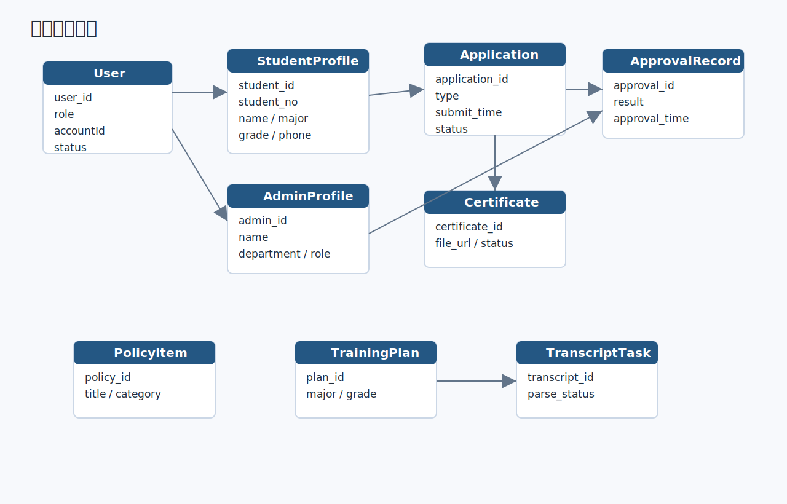

图 3-14 核心类设计总览图

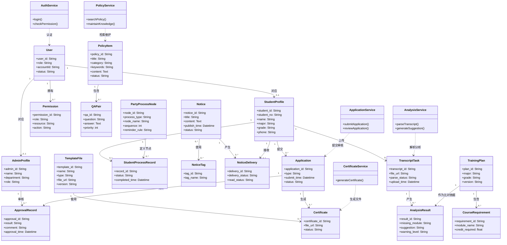
```mermaid
classDiagram
    class User {
        +user_id: String
        +role: String
        +accountId: String
        +status: String
    }

    class StudentProfile {
        +student_id: String
        +student_no: String
        +name: String
        +major: String
        +grade: String
        +phone: String
    }

    class AdminProfile {
        +admin_id: String
        +name: String
        +department: String
        +role: String
    }

    class Permission {
        +permission_id: String
        +role: String
        +resource: String
        +action: String
    }

    class PolicyItem {
        +policy_id: String
        +title: String
        +category: String
        +keywords: String
        +content: Text
        +status: String
    }

    class QAPair {
        +qa_id: String
        +question: String
        +answer: Text
        +priority: int
    }

    class TemplateFile {
        +template_id: String
        +name: String
        +type: String
        +file_url: String
        +version: String
    }

    class PartyProcessNode {
        +node_id: String
        +process_type: String
        +node_name: String
        +sequence: int
        +reminder_rule: String
    }

    class StudentProcessRecord {
        +record_id: String
        +status: String
        +completed_time: Datetime
    }

    class Notice {
        +notice_id: String
        +title: String
        +content: Text
        +publish_time: Datetime
        +status: String
    }

    class NoticeTag {
        +tag_id: String
        +tag_name: String
    }

    class NoticeDelivery {
        +delivery_id: String
        +delivery_status: String
        +read_status: String
    }

    class Application {
        +application_id: String
        +type: String
        +submit_time: Datetime
        +status: String
    }

    class ApprovalRecord {
        +approval_id: String
        +result: String
        +comment: String
        +approval_time: Datetime
    }

    class Certificate {
        +certificate_id: String
        +file_url: String
        +status: String
    }

    class TrainingPlan {
        +plan_id: String
        +major: String
        +grade: String
        +version: String
    }

    class CourseRequirement {
        +requirement_id: String
        +module_name: String
        +credit_required: float
    }

    class TranscriptTask {
        +transcript_id: String
        +file_url: String
        +parse_status: String
        +upload_time: Datetime
    }

    class AnalysisResult {
        +result_id: String
        +missing_module: String
        +suggestion: String
        +warning_level: String
    }

    class AuthService {
        +login()
        +checkPermission()
    }

    class PolicyService {
        +searchPolicy()
        +maintainKnowledge()
    }

    class ApplicationService {
        +submitApplication()
        +reviewApplication()
    }

    class CertificateService {
        +generateCertificate()
    }

    class AnalysisService {
        +parseTranscript()
        +generateSuggestion()
    }

    User "1" --> "0..1" StudentProfile : 对应
    User "1" --> "0..1" AdminProfile : 对应
    User "1" --> "0..*" Permission : 拥有
    PolicyItem "1" --> "0..*" QAPair : 包含
    TemplateFile "1" --> "0..*" Certificate : 套用
    StudentProfile "1" --> "0..*" StudentProcessRecord : 拥有
    PartyProcessNode "1" --> "0..*" StudentProcessRecord : 定义节点
    Notice "1" --> "0..*" NoticeDelivery : 产生
    Notice "0..*" --> "0..*" NoticeTag : 使用
    StudentProfile "1" --> "0..*" NoticeDelivery : 接收
    StudentProfile "1" --> "0..*" Application : 提交
    AdminProfile "1" --> "0..*" ApprovalRecord : 审核
    Application "1" --> "0..*" ApprovalRecord : 记录
    Application "1" --> "0..*" Certificate : 生成
    StudentProfile "1" --> "0..*" TranscriptTask : 上传
    TrainingPlan "1" --> "0..*" CourseRequirement : 包含
    TranscriptTask "1" --> "0..*" AnalysisResult : 产生
    TrainingPlan "1" --> "0..*" AnalysisResult : 作为比对依据

    AuthService ..> User : 认证
    PolicyService ..> PolicyItem : 检索维护
    ApplicationService ..> Application : 提交审核
    CertificateService ..> Certificate : 生成文件
    AnalysisService ..> TranscriptTask : 解析分析
```

图 3-15 核心设计类细化图

其中 `User`、`StudentProfile`、`AdminProfile` 和 `Permission` 支撑统一身份与 4 级权限控制；`PolicyItem`、`QAPair` 和 `TemplateFile` 支撑知识库咨询与模板下载；`Application`、`ApprovalRecord` 和 `Certificate` 构成申请审批与证明生成主链路；`TrainingPlan`、`CourseRequirement`、`TranscriptTask` 和 `AnalysisResult` 支撑成绩分析与选课建议。

申请单状态设计如下：

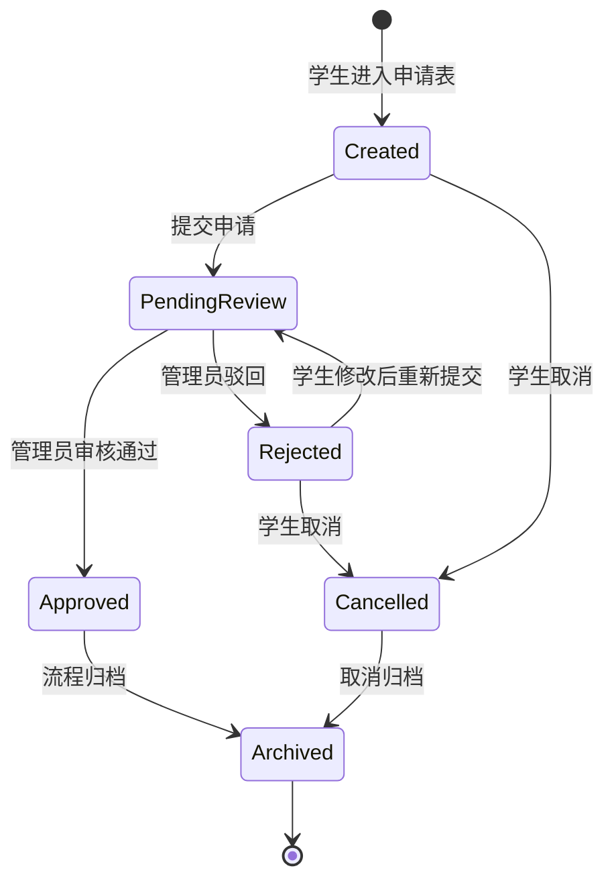
```mermaid
stateDiagram-v2
    [*] --> Created: 学生进入申请表
    Created --> PendingReview: 提交申请
    PendingReview --> Approved: 管理员审核通过
    PendingReview --> Rejected: 管理员驳回
    Rejected --> PendingReview: 学生修改后重新提交
    Created --> Cancelled: 学生取消
    Rejected --> Cancelled: 学生取消
    Approved --> Archived: 流程归档
    Cancelled --> Archived: 取消归档
    Archived --> [*]
```

图 3-16 申请单状态图

申请单状态图用于约束审批相关页面和后端状态流转。学生提交后进入待审核状态；管理员可通过或驳回；被驳回后允许学生在原申请基础上修改并重新提交；通过或取消后的记录进入归档，便于后续查询、统计和审计。

党团流程节点状态设计如下：

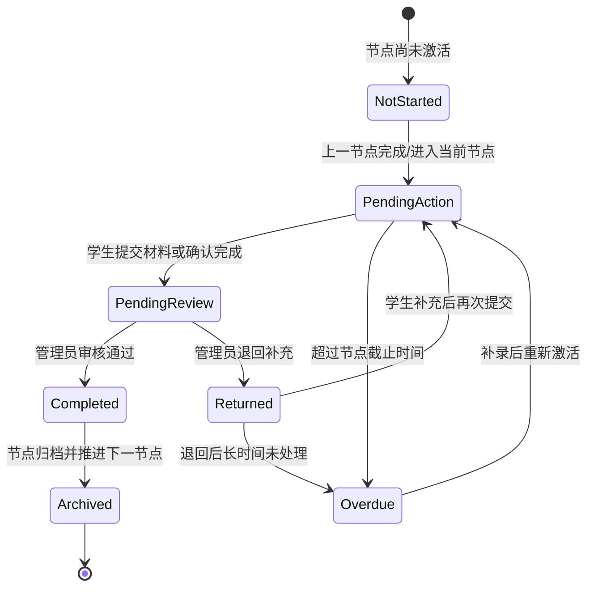
```mermaid
stateDiagram-v2
    [*] --> NotStarted: 节点尚未激活
    NotStarted --> PendingAction: 上一节点完成/进入当前节点
    PendingAction --> PendingReview: 学生提交材料或确认完成
    PendingReview --> Completed: 管理员审核通过
    PendingReview --> Returned: 管理员退回补充
    Returned --> PendingAction: 学生补充后再次提交
    PendingAction --> Overdue: 超过节点截止时间
    Returned --> Overdue: 退回后长时间未处理
    Overdue --> PendingAction: 补录后重新激活
    Completed --> Archived: 节点归档并推进下一节点
    Archived --> [*]
```

图 3-17 党团流程节点状态变迁图

该状态图对应 `StudentProcessRecord.status` 的主要状态变化，用于说明单个学生在某一党团流程节点上的推进逻辑。节点从“未激活”转入“待处理”后，学生可提交材料或确认完成；管理员审核通过后，节点进入“已完成”，并由流程服务推进至下一节点；若被退回，则学生需补充材料；若长期未处理，则节点进入“已逾期”。该图与 `PartyProcessNode` 中的节点顺序和提醒规则配置共同支撑党团流程的可视化追踪。

学业分析服务方法内部活动如下：

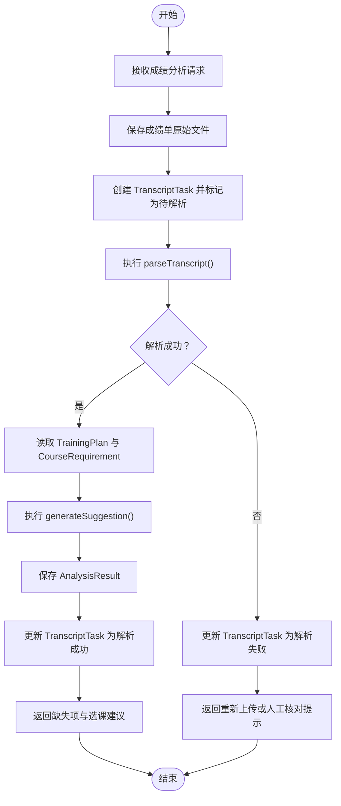
```mermaid
flowchart TD
    Start(["开始"])
    Receive["接收成绩分析请求"]
    SaveFile["保存成绩单原始文件"]
    CreateTask["创建 TranscriptTask 并标记为待解析"]
    ParseTranscript["执行 parseTranscript()"]
    ParseOK{"解析成功？"}
    LoadPlan["读取 TrainingPlan 与 CourseRequirement"]
    GenerateSuggestion["执行 generateSuggestion()"]
    SaveResult["保存 AnalysisResult"]
    UpdateSuccess["更新 TranscriptTask 为解析成功"]
    ReturnSuccess["返回缺失项与选课建议"]
    UpdateFail["更新 TranscriptTask 为解析失败"]
    ReturnFail["返回重新上传或人工核对提示"]
    End(["结束"])

    Start --> Receive
    Receive --> SaveFile
    SaveFile --> CreateTask
    CreateTask --> ParseTranscript
    ParseTranscript --> ParseOK
    ParseOK -- 是 --> LoadPlan
    LoadPlan --> GenerateSuggestion
    GenerateSuggestion --> SaveResult
    SaveResult --> UpdateSuccess
    UpdateSuccess --> ReturnSuccess
    ReturnSuccess --> End
    ParseOK -- 否 --> UpdateFail
    UpdateFail --> ReturnFail
    ReturnFail --> End
```

图 3-18 学业分析服务方法活动图

该活动图补充描述 `AnalysisService` 在一次成绩分析任务中的内部方法流转。服务先保存上传文件并创建分析任务，再通过 `parseTranscript()` 完成成绩单解析；若解析成功，则读取培养方案与课程模块要求，执行 `generateSuggestion()` 生成分析结果并持久化；若解析失败，则更新任务状态并返回错误提示。这样可与前文的顺序图形成“外部交互 + 内部方法处理”的对应关系。

### 3.5 数据设计 {#35数据设计}

本系统底层指定使用人大金仓（Kingbase）数据库。根据类图设计，主要数据表包括：

1. **用户及权限类表**：`sys_user`（统一用户表）、`student_profile`（学生信息表）、`admin_profile`（管理员信息表）、`user_permission`（用户权限表）。
2. **知识库与模板类表**：`policy_item`（政策文件表）、`qa_pair`（标准问答表）、`template_file`（模板文件表）。
3. **通知与流程类表**：`notice`（通知表）、`notice_tag`（通知标签表）、`notice_tag_relation`（通知标签关联表）、`notice_delivery`（通知投递表）、`party_process_node`（党团流程节点配置表）、`student_process_record`（学生流程进度表）。
4. **审批与证明类表**：`application`（申请单表）、`approval_record`（审批记录表）、`certificate`（电子证明记录表）。
5. **教务辅助类表**：`training_plan`（培养方案表）、`course_requirement`（课程模块要求表）、`transcript_task`（成绩分析任务表）、`analysis_result`（学业分析结果表）。

核心数据模型总览图如下。该图概括展示统一用户、学生信息、管理员信息、申请审批、证明文件、知识库和成绩分析任务之间的主要数据关系。

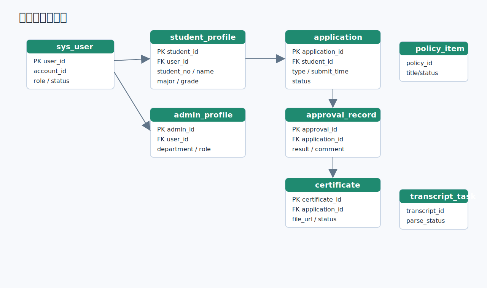

图 3-19 数据模型设计总览图

数据库实体关系设计如下。考虑到系统底层明确采用人大金仓（Kingbase）数据库，以下 ER 图中的字段类型采用 `VARCHAR`、`TEXT`、`TIMESTAMP`、`INTEGER`、`NUMERIC` 等更贴近物理数据库设计的表达方式，以增强实现层面的严谨性：

```mermaid
erDiagram
    SYS_USER ||--o| STUDENT_PROFILE : maps_to
    SYS_USER ||--o| ADMIN_PROFILE : maps_to
    SYS_USER ||--o{ USER_PERMISSION : owns
    POLICY_ITEM ||--o{ QA_PAIR : contains
    STUDENT_PROFILE ||--o{ STUDENT_PROCESS_RECORD : has
    PARTY_PROCESS_NODE ||--o{ STUDENT_PROCESS_RECORD : defines
    NOTICE ||--o{ NOTICE_DELIVERY : creates
    STUDENT_PROFILE ||--o{ NOTICE_DELIVERY : receives
    NOTICE ||--o{ NOTICE_TAG_RELATION : uses
    NOTICE_TAG ||--o{ NOTICE_TAG_RELATION : classifies
    STUDENT_PROFILE ||--o{ APPLICATION : submits
    ADMIN_PROFILE ||--o{ APPROVAL_RECORD : reviews
    APPLICATION ||--o{ APPROVAL_RECORD : has
    APPLICATION ||--o{ CERTIFICATE : generates
    TEMPLATE_FILE ||--o{ CERTIFICATE : applies
    STUDENT_PROFILE ||--o{ TRANSCRIPT_TASK : uploads
    TRAINING_PLAN ||--o{ COURSE_REQUIREMENT : contains
    TRANSCRIPT_TASK ||--o{ ANALYSIS_RESULT : produces
    TRAINING_PLAN ||--o{ ANALYSIS_RESULT : compares

    SYS_USER {
        VARCHAR user_id PK
        VARCHAR role
        VARCHAR account_id
        VARCHAR status
    }

    STUDENT_PROFILE {
        VARCHAR student_id PK
        VARCHAR user_id FK
        VARCHAR student_no
        VARCHAR name
        VARCHAR major
        VARCHAR grade
        VARCHAR phone
    }

    ADMIN_PROFILE {
        VARCHAR admin_id PK
        VARCHAR user_id FK
        VARCHAR name
        VARCHAR department
        VARCHAR role
    }

    USER_PERMISSION {
        VARCHAR permission_id PK
        VARCHAR user_id FK
        VARCHAR resource
        VARCHAR action
    }

    POLICY_ITEM {
        VARCHAR policy_id PK
        VARCHAR title
        VARCHAR category
        TEXT keywords
        VARCHAR status
    }

    QA_PAIR {
        VARCHAR qa_id PK
        VARCHAR policy_id FK
        TEXT question
        TEXT answer
        INTEGER priority
    }

    TEMPLATE_FILE {
        VARCHAR template_id PK
        VARCHAR name
        VARCHAR type
        VARCHAR file_url
        VARCHAR version
    }

    PARTY_PROCESS_NODE {
        VARCHAR node_id PK
        VARCHAR process_type
        VARCHAR node_name
        INTEGER sequence
        VARCHAR reminder_rule
    }

    STUDENT_PROCESS_RECORD {
        VARCHAR record_id PK
        VARCHAR student_id FK
        VARCHAR node_id FK
        VARCHAR status
        TIMESTAMP completed_time
    }

    NOTICE {
        VARCHAR notice_id PK
        VARCHAR title
        TEXT content
        TIMESTAMP publish_time
        VARCHAR status
    }

    NOTICE_TAG {
        VARCHAR tag_id PK
        VARCHAR tag_name
    }

    NOTICE_TAG_RELATION {
        VARCHAR relation_id PK
        VARCHAR notice_id FK
        VARCHAR tag_id FK
    }

    NOTICE_DELIVERY {
        VARCHAR delivery_id PK
        VARCHAR notice_id FK
        VARCHAR student_id FK
        VARCHAR delivery_status
        VARCHAR read_status
    }

    APPLICATION {
        VARCHAR application_id PK
        VARCHAR student_id FK
        VARCHAR type
        TIMESTAMP submit_time
        VARCHAR status
    }

    APPROVAL_RECORD {
        VARCHAR approval_id PK
        VARCHAR application_id FK
        VARCHAR approver_id FK
        VARCHAR result
        TEXT comment
        TIMESTAMP approval_time
    }

    CERTIFICATE {
        VARCHAR certificate_id PK
        VARCHAR application_id FK
        VARCHAR template_id FK
        VARCHAR file_url
        VARCHAR status
    }

    TRAINING_PLAN {
        VARCHAR plan_id PK
        VARCHAR major
        VARCHAR grade
        VARCHAR version
    }

    COURSE_REQUIREMENT {
        VARCHAR requirement_id PK
        VARCHAR plan_id FK
        VARCHAR module_name
        NUMERIC credit_required
    }

    TRANSCRIPT_TASK {
        VARCHAR transcript_id PK
        VARCHAR student_id FK
        VARCHAR file_url
        VARCHAR parse_status
        TIMESTAMP upload_time
    }

    ANALYSIS_RESULT {
        VARCHAR result_id PK
        VARCHAR transcript_id FK
        VARCHAR plan_id FK
        TEXT missing_module
        TEXT suggestion
        VARCHAR warning_level
    }
```

图 3-20 数据库 ER 图

数据导入导出与持久化操作流程如下：

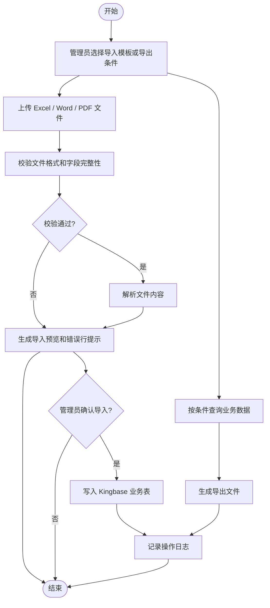
```mermaid
flowchart TD
    Start([开始])
    SelectTemplate[管理员选择导入模板或导出条件]
    Upload[上传 Excel / Word / PDF 文件]
    Validate[校验文件格式和字段完整性]
    Valid{校验通过?}
    Parse[解析文件内容]
    Preview[生成导入预览和错误行提示]
    Confirm{管理员确认导入?}
    WriteDB[写入 Kingbase 业务表]
    Export[按条件查询业务数据]
    GenerateFile[生成导出文件]
    SaveLog[记录操作日志]
    Finish([结束])

    Start --> SelectTemplate
    SelectTemplate --> Upload
    SelectTemplate --> Export
    Upload --> Validate
    Validate --> Valid
    Valid -- 否 --> Preview
    Preview --> Finish
    Valid -- 是 --> Parse
    Parse --> Preview
    Preview --> Confirm
    Confirm -- 否 --> Finish
    Confirm -- 是 --> WriteDB
    WriteDB --> SaveLog
    Export --> GenerateFile
    GenerateFile --> SaveLog
    SaveLog --> Finish
```

图 3-21 数据操作活动图

数据设计与类设计保持对应关系：类图中的核心业务对象均在 ER 图中有持久化表支撑；多对多关系通过关联表表达；通知投递、审批记录、流程进度和成绩分析结果均单独成表，便于追踪历史状态和进行后续统计。批量导入导出过程必须经过格式校验、预览确认和日志记录，避免错误数据直接写入业务表。

### 3.6 部署设计 {#36部署设计}

系统的部署架构总览图如下。该图从客户端、反向代理区、服务与数据区三个视角概括系统运行环境。

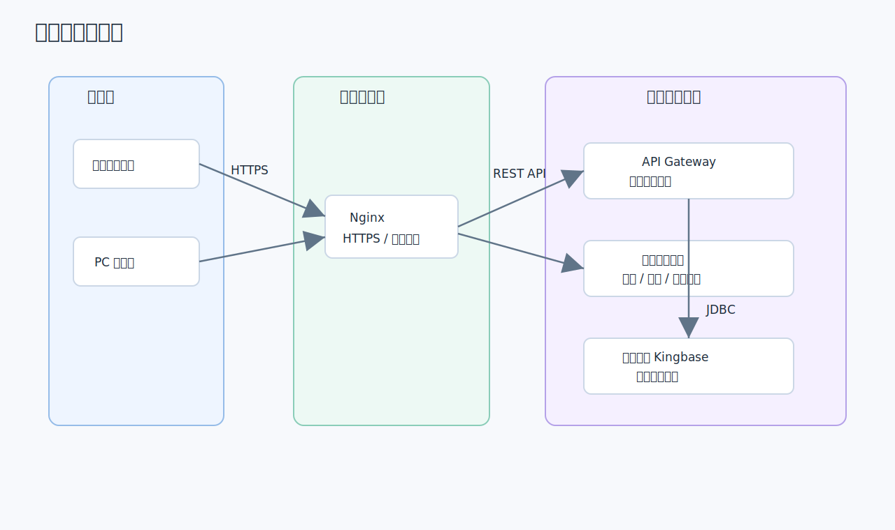

图 3-22 系统部署设计总览图

系统的部署架构设计如下。与 3.1 节的逻辑架构图不同，本图重点描述运行节点和部署位置，回答“系统组件部署在哪些服务器或资源节点上”。

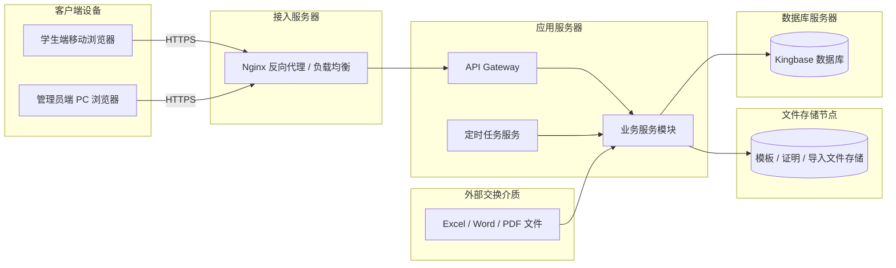
```mermaid
flowchart LR
    subgraph ClientNode[客户端设备]
        client1[学生端移动浏览器]
        client2[管理员端 PC 浏览器]
    end

    subgraph AccessNode[接入服务器]
        nginx[Nginx 反向代理 / 负载均衡]
    end

    subgraph AppNode[应用服务器]
        api[API Gateway]
        service[业务服务模块]
        scheduler[定时任务服务]
    end

    subgraph FileNode[文件存储节点]
        file[(模板 / 证明 / 导入文件存储)]
    end

    subgraph DBNode[数据库服务器]
        kingbase[(Kingbase 数据库)]
    end

    subgraph ExternalNode[外部交换介质]
        importFile[Excel / Word / PDF 文件]
    end

    client1 -->|HTTPS| nginx
    client2 -->|HTTPS| nginx
    nginx --> api
    api --> service
    scheduler --> service
    service --> kingbase
    service --> file
    importFile --> service
```

图 3-23 系统部署细化图

部署说明：

- 客户端通过 HTTPS 协议访问接入服务器，学生端与管理员端共享统一入口。
- 接入服务器上的 Nginx 负责反向代理、负载均衡和静态资源分发，对外屏蔽后端服务细节。
- 应用服务器部署 API Gateway、业务服务模块和定时任务服务，集中承载认证鉴权、业务处理与后台提醒任务。
- 文件存储节点独立保存导入文件、证明模板和自动生成的电子证明，避免与数据库职责混淆。
- 数据库服务器独立部署 Kingbase，负责持久化核心业务数据，以确保数据安全与高可用。
- 为应对奖学金申请集中期等峰值访问场景，API Gateway 与业务服务层应配置合理的连接池机制，并对政策文件、培养方案等高频只读数据在应用内存中进行轻量级缓存，以降低底层 Kingbase 数据库的 I/O 压力。
