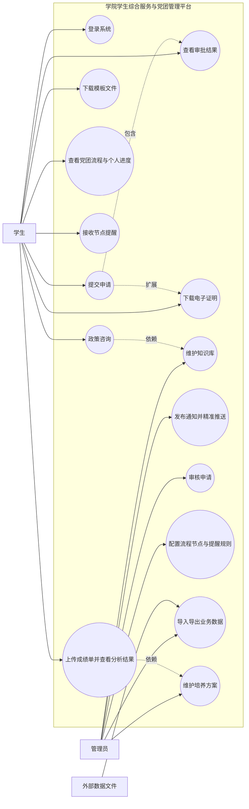
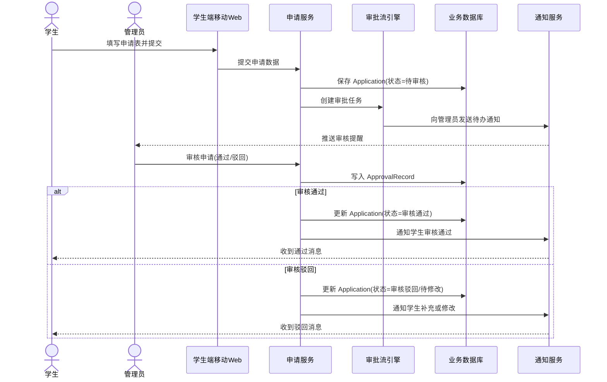
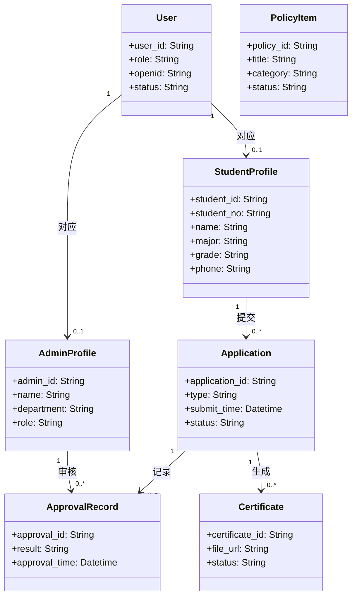
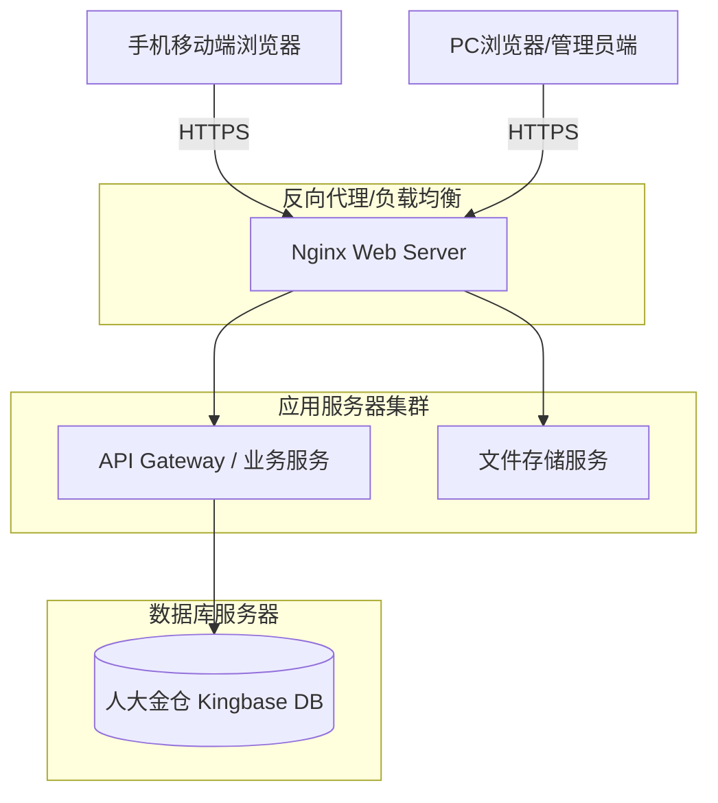

**文档编号：学院学生综合服务与党团管理平台 -- SDS -- 1.0**

**学院学生综合服务与党团管理平台**

**软件设计规格说明书**

**日期：2026年5月12日**

\
**文档变更历史记录**

| 序号 | 变更日期 | 变更人员 | 变更内容详情描述 | 版本 |
|------|----------|----------|------------------|------|
| 1    |    2026.5.12      |       钟晓懿   |        初始版本 | 1.0 |
| 2    |    2026.5.12      |       彭芊郗   |   完成了引言部分 |  1.1  |
| 3    |    2026.5.13      |       彭芊郗   |   完善了软件设计约束的部分内容  |  1.2  |
| 4    |          |          |                  |      |
| 5    |          |          |                  |      |
| 6    |          |          |                  |      |
| 7    |          |          |                  |      |
| 8    |          |          |                  |      |
| 9    |          |          |                  |      |
| 10   |          |          |                  |      |

**目录**

- [1、引言](#1引言)
  - [1.1 编写目的](#11编写目的)
  - [1.2 读者对象](#12读者对象)
  - [1.3 软件项目概述](#13软件项目概述)
  - [1.4 文档概述](#14文档概述)
  - [1.5 定义](#15定义)
  - [1.6 参考资料](#16参考资料)
- [2、软件设计约束](#2软件设计约束)
  - [2.1 软件设计目标和原则](#21软件设计目标和原则)
  - [2.2 软件设计的约束和限制](#22软件设计的约束和限制)
- [3、软件设计](#3软件设计)
  - [3.1 软件体系结构设计](#31软件体系结构设计)
  - [3.2 用户界面设计](#32用户界面设计)
  - [3.3 用例设计](#33用例设计)
  - [3.4 类设计](#34类设计)
  - [3.5 数据设计](#35数据设计)
  - [3.6 部署设计](#36部署设计)

# **1、引言** {#1引言}

### 1.1 编写目的 {#11编写目的}

本文档作为“学院学生综合服务与党团管理平台”的软件设计规格说明书（SDS），其编写目的是在《软件需求规格说明书》（SRS）的基础上，对系统进行概要设计与详细设计。文档详细描述了系统的技术架构、界面逻辑、用例实现过程、类结构、数据库物理设计及部署方案，旨在为开发小组提供明确的编码指引，为测试团队提供系统验证依据，并确保最终实现的软件能够准确满足学院学生事务管理的需求。

本文档旨在详细描述“学院学生综合服务与党团管理平台”的软件体系结构、系统接口、数据库设计及各模块的详细设计。本文档将作为系统开发阶段的指导性文件，为后续的编码实现、测试用例编写及系统维护提供明确的技术蓝图。

### 1.2 读者对象 {#12读者对象}

1. **开发团队**：彭芊郗、郭心蕾、钟晓懿、刘小渔四人小组，负责根据本文档完成前后端编码与系统集成。
2. **测试团队**：负责根据设计逻辑编写集成测试用例，验证系统功能与性能指标的达成情况。
3. **项目评审人员**：包括课程老师、助教及评审同学，用于评估系统设计的规范性、合理性与可实现性。
4. **用户单位管理人员**：中国人民大学信息学院相关负责人，用于了解系统的技术实现框架与安全保障机制。

### 1.3 软件项目概述 {#13软件项目概述}

* **项目名称**：学院学生综合服务与党团管理平台
* **项目简称**：学生综合服务平台
* **用户单位**：中国人民大学信息学院
* **开发单位**：彭芊郗、郭心蕾、钟晓懿、刘小渔四人小组
* **软件项目的大致需求描述**：
* **功能需求**：系统核心功能包括基于知识库的 AI 智能咨询、党团培养全过程的可视化追踪、基于学生标签的精准通知推送、在读证明等电子文件的自动生成与审批流处理，以及学业成绩分析与选课建议功能。
* **性能需求**：系统需支持全院约 1200~1300 人用户规模，关键节点（如奖学金申请集中期）并发访问量需达到 300 人左右，常规查询响应时间应控制在 2 秒内。

### 1.4 文档概述 {#14文档概述}

本文档共分为三个主要章节：

1. **引言**：定义文档目的、读者、项目背景、专业术语及参考资料。
2. **软件设计约束**：明确软件设计的目标原则，以及受到的运行环境、安全性、权限等方面的限制。
3. **软件设计**：详细描述软件的体系结构、用户界面、用例实现、精化类图、数据库物理设计及部署图。

### 1.5 定义 {#15定义}

1. **SDS**：Software Design Specification，软件设计规格说明书。
2. **SRS**：Software Requirements Specification，软件需求规格说明书。
3. **Kingbase**：人大金仓数据库管理系统，为本项目指定的后端数据库。
4. **学生端**：基于 Web 的前端应用，适配移动端与PC端浏览器，面向学生提供综合服务。
5. **管理员端**：基于 Web 的 PC 后台管理系统，面向老师及管理人员。
6. **审批流**：学生提交申请后，经系统按照既定顺序流转至管理员审核的业务过程。
7. **智能问答**：系统基于政策知识库内容进行关键词检索或相似匹配提供的咨询服务。
8. **知识库**：指由政策文件、标准问答、模板附件等组成的可检索内容集合，用于支持学生咨询。
9. **精准推送**：系统根据学生画像、标签（如“就业”、“实习”等），将信息有针对性地发送给符合条件的用户。

### 1.6 参考资料 {#16参考资料}

1. 《学院学生综合服务与党团管理平台软件需求规格说明书》，版本 V08，开发小组编写。
2. 《学院学生综合服务与党团管理平台》产品需求文档。
3. W3C Web 前端开发相关标准与规范文档。
4. Kingbase 数据库技术参考手册，人大金仓发布。
5. 学院现行学生事务、党团管理制度及办事流程相关材料。

# **2、软件设计约束** {#2软件设计约束}

### 2.1 软件设计目标和原则 {#21软件设计目标和原则}

***\<描述软件设计欲达到的目标，如实现用户需求，软件系统具有良好的可扩充性等等\>***

***\<描述为实现软件设计目标，在设计软件过程中应遵循的一般性设计原则\>***

**软件设计目标：**
1. **功能完备性**：全面覆盖需求文档中定义的党团管理、智能问答、审批证明及学业分析等核心业务闭环。
2. **系统易用性**：学生端采用 Web 网页形式（适配移动端与PC端），无需下载安装，交互简洁；管理员端提供清晰的导航与批量处理能力，降低管理成本。
3. **安全性与保密性**：实现严格的4级权限体系（学院领导、管理老师、班团骨干、普通学生），并对高度敏感信息进行加密存储和操作日志审计。
4. **可扩充性**：采用模块化架构设计，保证后续可灵活接入出国申请、评奖评优细则等新功能模块。

**一般性设计原则：**
1. **高内聚低耦合原则**：各业务模块（如党团流程、信息推送、审批流）相互独立，通过统一定义的API进行交互。
2. **前后端分离原则**：前端专注于界面展示与用户交互，后端专注于业务逻辑和数据处理。
3. **健壮性原则**：在异常操作或高并发（如日均数倍峰值）情况下，系统能够提供友好的错误提示，并保证核心数据的一致性。
4. **数据驱动原则**：业务流程（如党团阶段、审批节点）尽量可配置化，减少硬编码，提高系统对政策变动的适应性。

### 2.2 软件设计的约束和限制 {#22软件设计的约束和限制}

***\<列举和描述软件设计需要考虑的约束和限制***

- ***运行环境要求：硬件平台、OS***

- ***开发语言***

- ***标准规范***

- ***开发工具***

- ***容量和性能要求***

- ***灵活性和配置要求，等等\>***

- **运行环境要求：硬件平台、OS**
  - **前端（学生端与管理员端）**：采用 Web 网页形式（适配移动端与 PC 端），需兼容主流现代浏览器（Chrome、Safari、Edge 等）。
  - **后端服务**：部署于 Linux/Windows 服务器环境。
  - **数据库**：必须采用国产人大金仓（Kingbase）数据库进行数据存储。

- **开发语言**
  - 采用前后端分离开发（前端采用 Vue/React 等主流响应式 Web 框架；后端采用 Java/Python/Go 等常见 Web 框架开发，视开发团队技术栈而定）。

- **标准规范**
  - W3C Web 前端开发相关标准与规范。
  - HTTP/HTTPS 协议及 RESTful API 接口规范。

- **开发工具**
  - 前端开发工具：VS Code、WebStorm 等。
  - 后端开发工具：IntelliJ IDEA、PyCharm、GoLand 等。
  - 数据库管理工具：人大金仓数据库开发管理工具。

- **容量和性能要求**
  - 预估最大同时在线并发约 300 人（其中管理人员约 10 人）。
  - 常规查询响应时间应控制在 2 秒内，首次加载时间不超过 3 秒。
  - 支持较大文件的批量导入与导出，单次上传文件大小限制约为 30MB。
  - 审批记录至少保存 1 年。

- **灵活性和配置要求**
  - **外部系统交互**：暂无法直接对接校级“微人大”系统接口，数据同步依赖人工通过 Excel/Word/PDF 批量导入导出。对于学校官方办理的事项，仅提供说明和外链引导。
  - **安全与权限控制**：需建立严格的 4 级权限体系（学院领导、管理老师、班团骨干、普通学生）。用户身份验证基于统一身份认证系统或账号密码登录，并需建立操作日志记录系统。
  - **业务配置**：智能问答以知识库检索为准，业务流程需适配现行制度并支持参数化配置。

# **3、软件设计** {#3软件设计}

### 3.1 软件体系结构设计 {#31软件体系结构设计}

***\<详细描述软件系统的体系结构设计，可以采用包图描述体系结构的逻辑模型，并提供必要的文字补充说明\>***

本系统采用经典的分层架构和前后端分离设计模式，逻辑模型自上而下分为：
1. **表现层（UI）**：
   - 学生端（移动端Web）：负责学生侧的政策查询、流程查看、申请提交等交互，主要适配手机屏幕。
   - 管理员端（PC Web）：负责教师侧的知识库维护、审批处理、数据统计等交互，适配大屏操作。
2. **业务逻辑层（BLL）**：
   - 包含系统的核心服务模块：用户认证服务、智能问答服务、党团流程服务、通知推送服务、审批流服务、电子证明服务和学业分析服务。
3. **数据访问层（DAL）**：
   - 负责与底层人大金仓（Kingbase）数据库的交互，执行数据的增删改查操作，并处理外部文件的导入导出。

### 3.2 用户界面设计 {#32用户界面设计}

***\<给出软件用户界面的设计模型，包括用户界面的设计类图、描述界面跳转关系的顺序图等，用户界面的原型，并提供必要的文字补充说明\>***

系统的用户界面分为学生端和管理员端，详细界面设计已输出为SVG原型文件：
- **学生端移动Web原型**（参考原 `student-miniapp-prototype.svg` 调整适配浏览器）：
  - 首页：蓝白配色的学院风，提供常用功能入口（如党团流程、智能咨询等）。
  - 党团流程页：线性可视化展示入党/入团全过程及当前进度。
  - 成绩分析页：提供成绩单上传与解析功能。
- **管理员端后台原型**（参考 `admin-web-prototype.svg`）：
  - 采用典型的“左侧导航+顶部面包屑+主内容区”布局。
  - 包含首页、用户管理、知识库管理、流程配置、审批管理、模板管理和培养方案维护等模块。

### 3.3 用例设计 {#33用例设计}

***\<给出各个用例的设计模型，包括描述用例实现的顺序图、用例实现的设计类图等，并提供必要的文字补充说明\>***

以下为系统的核心用例设计模型，包含总用例图与部分核心业务的顺序图。

**系统用例图**：

**申请审批顺序图**：

### 3.4 类设计 {#34类设计}

***\<给出各个类的实现模型，包括详细描述各个类的可见范围、类的属性和方法，给出精化后的类图，描述类方法的活动图，类对象的状态图等，并提供必要的文字补充说明\>***

以下为系统精化后的核心分析类图：

### 3.5 数据设计 {#35数据设计}

***\<给出软件系统中永久数据的设计模型，包括描述数据库及表的设计类图，描述数据操作的活动图、必须提供必要的文字补充说明\>***

本系统底层指定使用人大金仓（Kingbase）数据库。根据类图设计，主要数据表包括：
1. **用户及权限类表**：`sys_user`（统一用户表）、`student_profile`（学生信息表）、`admin_profile`（管理员信息表）。
2. **知识库与通知类表**：`policy_item`（政策文件表）、`notice`（通知表）。
3. **流程与审批类表**：`application`（申请单表）、`approval_record`（审批记录表）、`party_process_node`（党团流程节点配置表）。
4. **教务辅助类表**：`training_plan`（培养方案表）、`transcript_task`（成绩分析任务表）。

### 3.6 部署设计 {#36部署设计}

***\<用部署图描述目标软件系统的部署设计，提供必要的文字补充说明\>***

系统的部署架构设计如下：

部署说明：
- 客户端通过 HTTPS 协议访问服务器。
- Nginx 作为反向代理处理静态资源请求（如证明模板、前台图片）并转发动态 API 请求。
- 应用服务处理核心业务逻辑。
- 数据库独立部署以确保数据安全与高可用。
